# What's new in Max 8

 
# MC = multi channel

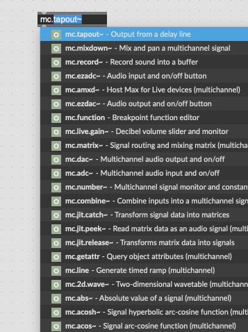

## Das blaue Kabel

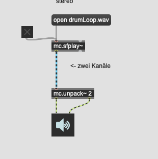

### mc.pack~ und mc.unpack~
 
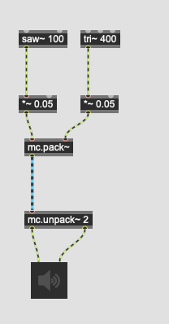

einpacken/auspacken
 
### mc.lores~
 
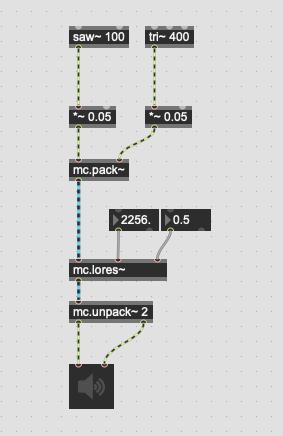
 
 hier sind mehrere Instanzen von mc.lores~ nicht nötig.
 
### mc.target
 
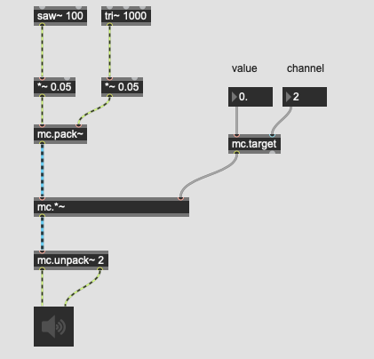

Parametersteuerung pro Kanal.

### mc.dup~

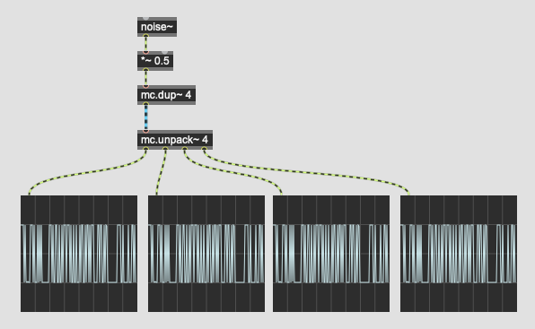

kanal duplizieren

### meter~ und levelmeter~

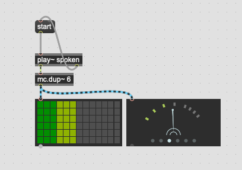
 
### multigain~

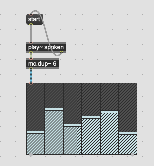

## Anwendungsbeispiel

### Vocoder

#### Before

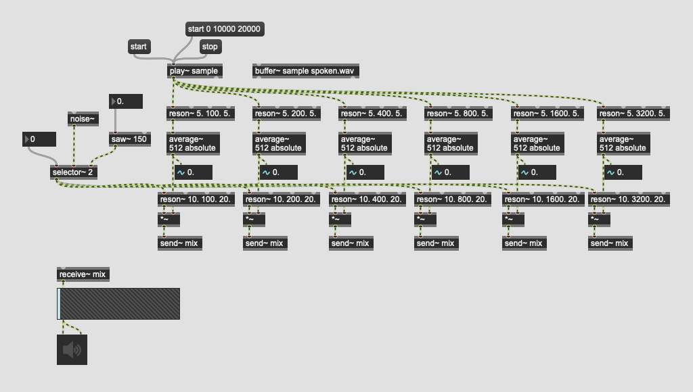

#### After

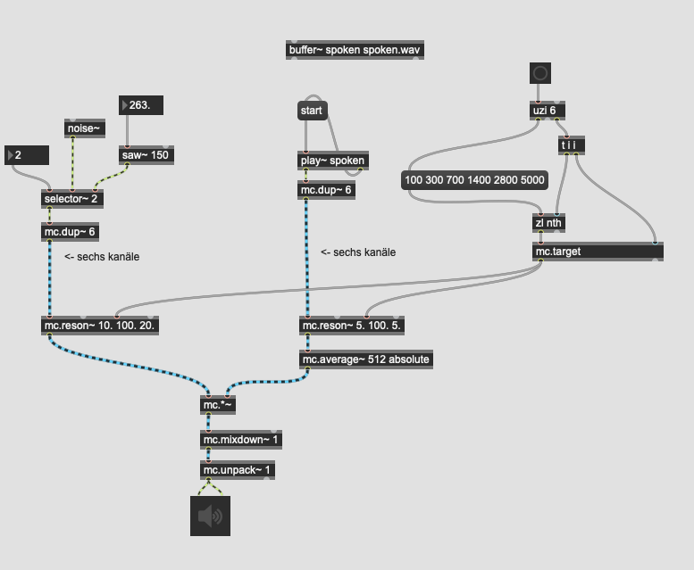

### Massive Sample

#### Before

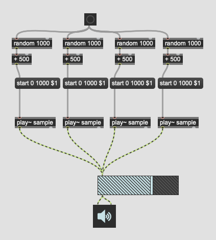

#### After

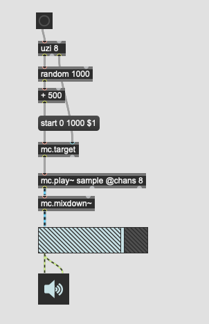

# vst3 support

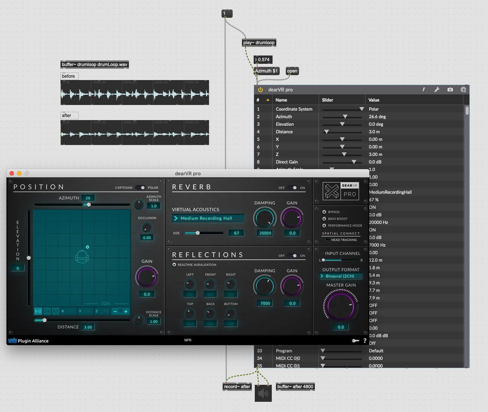

