# K1 Automation with GUI (1)

In Max, there are many ways to automate parameters.
The easiest and the most intuitive one would be GUI-based automation.

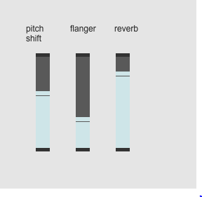

## [preset] 
[preset] object saves the current values of several GUI objects and associate them with a number (preset number). We can load those saved values using preset numbers.

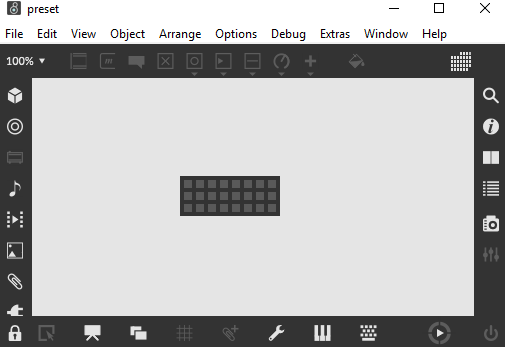

### A) With Patch cord

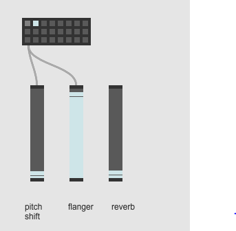

Preset saves only pitchshift and flanger.

### B) Without Patch cord

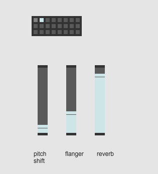

Preset saves all Sliders

### C) Exclusive Mode

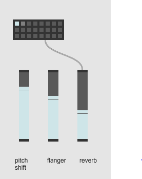

This patch works exactly like A

### Under the hood

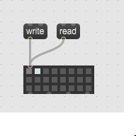

"Write" exports the saved preset als .json file.

### Assignment 1: Mixing Jamie

Download [Mix Practice](K1/mix_practice.zip) patch, mix the rock song in 3 different ways using sliders and panning knobs and save them in the patch.

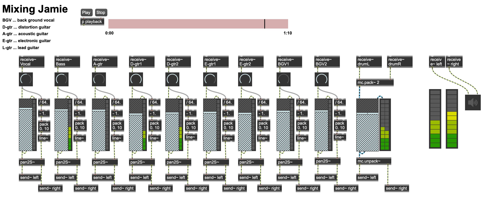

## Function Object
With function object, you can draw the transition of value over time graphically and intuitively.

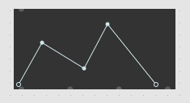

### Read (XY)

By sending a int/float value to the function, it outputs the corresponding Y value.

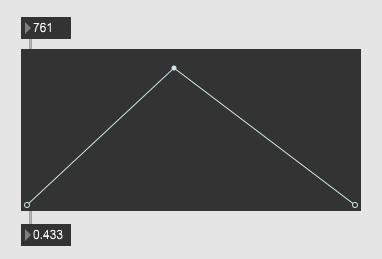

### Assignment 2: Graphic score

Compose a 10-seconds phrase using function object and play it with a sawtooth wave. You can use the frequency range from 200 to 2000 Hz.

Hint: 
1. Study what function outputs from its second outlet, when it receives a bang.
2. [line~] and [saw~]

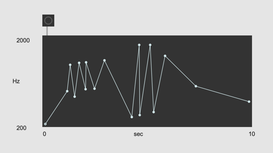

### Curve Mode
You can enable curve mode to draw curves. The line can be bent by dragging the line while pressing the option/alt key.
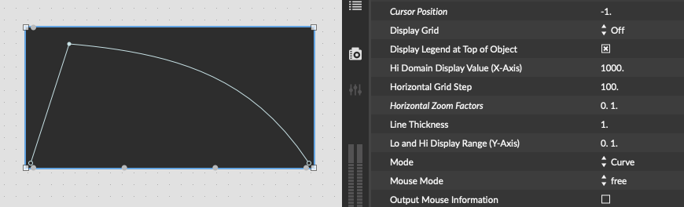

### Assignment 3: Curve as sound

Extend your piece for assignment 2, using the curve, study [curve~] object and sonificate also the curves in the graphic score.

### Assignment 4: Multiple pieces

Compose 2 - 3 phrases using the function object and save/load them using the preset object.

## What to control with function object

With function object, very common musical parameters such as **pitch** or **amplitude** can be easily controlled, but unlike other software, we can control **meta parameters** in Max.

### Assignment 5: Like a turntablist

record 1 second of voice using [record~] to [buffer~].
With [play~] and [curve~] playback the recorded voice, using function object's X-axis as time Y-axis as position in buffer~.

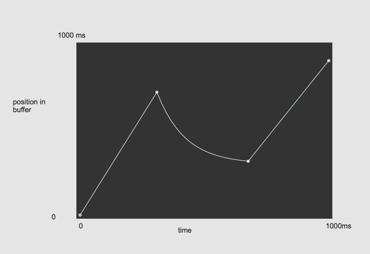

### Assignment 6: Playback speed control

Load [spoken.wav](K1/spoken.wav) onto a buffer and playback the buffer.
With a function object, control the speed of playback between 0.5 (half speed) and 2.0 (double speed).

Hint: [sampstoms~] [+=~] or [groove~]

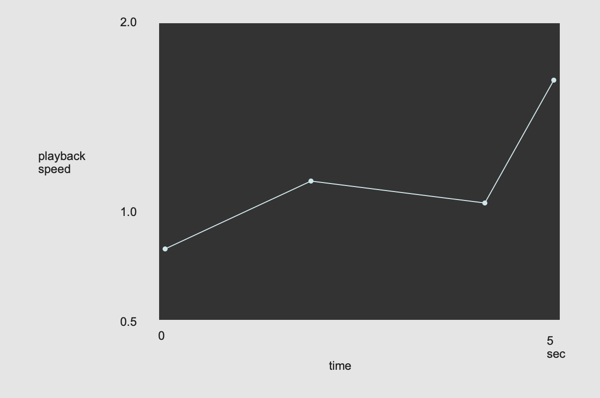
