# Automation mit GUI

## Preset Object

### A) Mit Patchcord

Preset speichert nur pitchshift und flanger.

### B) Ohne Patchcord

Preset speichert alle Sliders

### C) Exclusive Mode

Dieses Patch funktioniert genau wie (A)

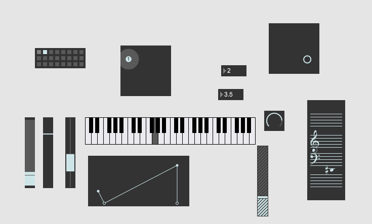

### Under the hood

"Write" expotiert gespeicherte Presets als .json Datei. (wie max patch)

## Funktion Objekt

### Kurve Modus

### Read (XY)

### mit curve~

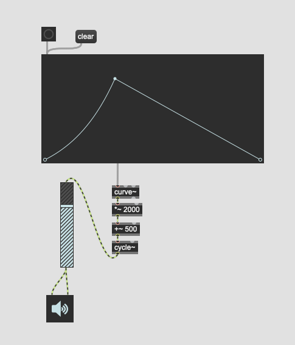

#### sig~ Familie

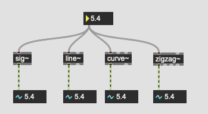

##### ramp

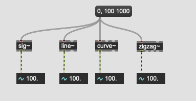

##### multi-segment

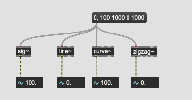

##### wiederholung

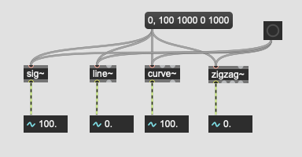

## Sustain Mode

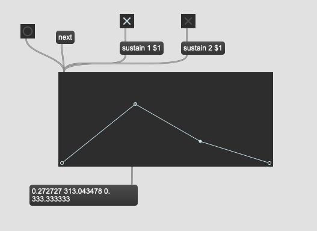

### ADSR Envelope

### Kombination

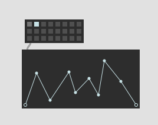

## Kreative Anwendungen von Function

### 1. Strange Loop Machine
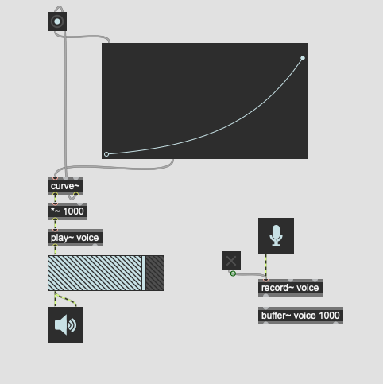

### 2. Wiedergabegeschwindigkeit

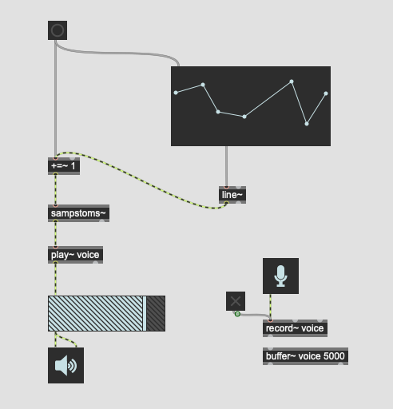

### 3. Wahrscheinlichkeit / Preset / itable

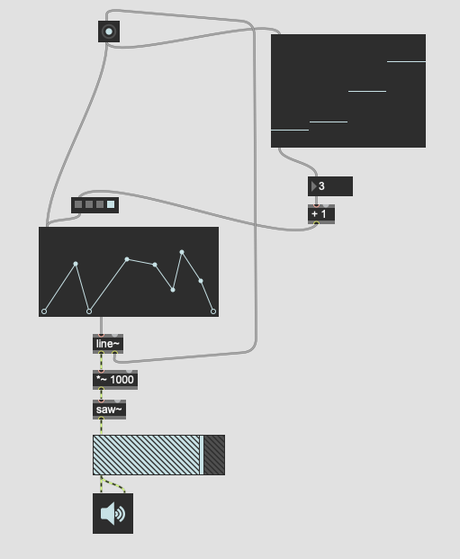

