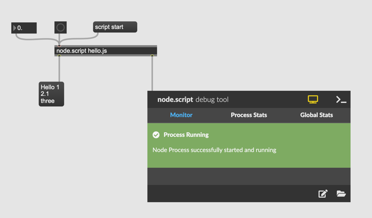
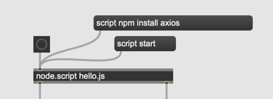

# K10 Data-based sonification

## Sonification

```
Sonification is the use of non-speech audio to convey information or perceptualize data.[1] Auditory perception has advantages in temporal, spatial, amplitude, and frequency resolution that open possibilities as an alternative or complement to visualization techniques.

For example, the rate of clicking of a Geiger counter conveys the level of radiation in the immediate vicinity of the device.
```

Markus Schmickler
[Bonner durchmusterung](http://piethopraxis.org/projects/bonner-durchmusterung/)


## Node.js

```
Node.js is a cross-platform, open-source server environment. Node.js is a back-end JavaScript runtime environment, runs on the V8 JavaScript engine, and executes JavaScript code outside a web browser.

Node.js lets developers use JavaScript to write command line tools and for server-side scripting. The ability to run JavaScript code on the server is often used to generate dynamic web page content before the page is sent to the user's web browser. Consequently, Node.js represents a "JavaScript everywhere" paradigm, unifying web-application development around a single programming language, as opposed to using different languages for the server- versus client-side programming.
```
### Node for Max Intro Video

[Video](https://www.youtube.com/watch?v=qSZH6fjOcXE)

### API

[Node for Max](https://docs.cycling74.com/nodeformax/api/)


### Assignment 1: hello node.js

Make a patch like the following screenshot. You may need to place an empty hello.js file in the same directory of the patch.



Copy the following code 

```
const maxAPI = require("max-api");
maxAPI.addHandler("bang",  ()=>{
    maxAPI.outlet("Hello", 1, 2.1, "three");
});
```

and start the script. Then, send a bang to [node.script] object.  
Did you get "Hello 1 2.1 three" in the message box?

The code above defines that when [node.script] object receives a bang inits inlet, it outputs "Hello 1 2.1 three" from its outlet.

### Assignment 2: Handling numbers 

At the bottom of the code for assignment 1 add following lines
```
const maxAPI = require("max-api");
maxAPI.addHandler("bang",  ()=>{
    maxAPI.outlet("Hello", 1, 2.1, "three");
});

maxAPI.addHandler("number", (in)=>{
    maxAPI.outlet(in + 5);
});
```
The added lines defines that "if the [node.script] object receives a number, add 5 to that number and output"

### Assignment 3: Getting Information about countries from REST Countries

[Rest Countries](https://restcountries.com/) offers comprehensive data about countries on the earth.

We can access information of countries on the browser by accessing the following URL  
[https://restcountries.com/v3.1/name/germany](https://restcountries.com/v3.1/name/germany)

Those data format are called JSON, and we need to parse the data to extract what we are interested in. 


Copy the following code 
```
const maxAPI = require("max-api");
const axios = require("axios");

maxAPI.addHandler("bang", async ()=>{
	const response = await axios.get('https://restcountries.com/v3.1/name/germany');
	maxAPI.outlet(response.data[0].population);
});
```
and send a bang to the [node.script] to get the population of Germany in the patch.

Hint: You need to install "axios" package to execute the code. To install "axios", send "script npm install axios" in the patch.



### Assignment 4: Check the population of different countries

Improve the code for assignment 3 and enable the [node.script] to answer the population of all countries by sending country's name to it.


### Assignment 5: Getting BitCoin's current price

[CoinGecko](https://www.coingecko.com/) provides the updated price info of all available crypto.

For example, we can get bitcoin's price in Euro by accessing the following URL.  
[https://api.coingecko.com/api/v3/simple/price?ids=bitcoin&vs_currencies=eur](https://api.coingecko.com/api/v3/simple/price?ids=bitcoin&vs_currencies=eur)

Copy the following code and let [node.script] outputs the current price of bitcoin in Euro.
``` 
const maxAPI = require("max-api");
const axios = require("axios");

maxAPI.addHandler("bang", async ()=>{
	const response = await axios.get('https://api.coingecko.com/api/v3/simple/price?ids=bitcoin&vs_currencies=eur');
	maxAPI.outlet(response.data.bitcoin.eur);
});
``` 

### Assignment 6: Getting Current temperature of Cologne

[OpenMeteo](https://open-meteo.com/) provides accurate weather forecast for any location.

For example, we can get Cologne's temperature by accessing the following URL.  
[https://api.open-meteo.com/v1/forecast?latitude=50.94&longitude=6.96&current_weather=true](https://api.open-meteo.com/v1/forecast?latitude=50.94&longitude=6.96&current_weather=true)

Copy the following code and let [node.script] outputs the current temperature of Cologne.
```
const maxAPI = require("max-api");
const axios = require("axios");

maxAPI.addHandler("bang", async ()=>{
const response = await axios.get('https://api.open-meteo.com/v1/forecast?latitude=50.94&longitude=6.96&current_weather=true');
    maxAPI.outlet(response.data.current_weather.temperature);
});
```

### Assignment 7: Sonification

Use [node.script] object to request the data available on the internet and sonificate the received data in your own way.

### Node 4 Max examples

[n4m-examples](https://github.com/Cycling74/n4m-examples)
  