# Klasse 2

### Problem

- Parameteränderung in einem Live-Stück

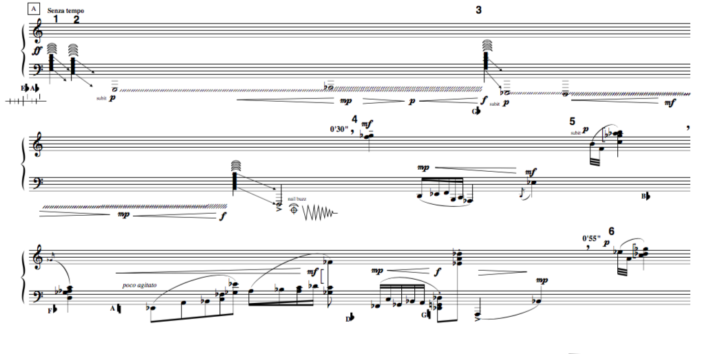

### Message Box
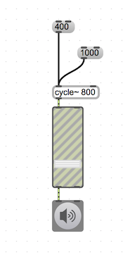

### Message Box ohne Patchcord

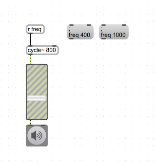

### Qlist

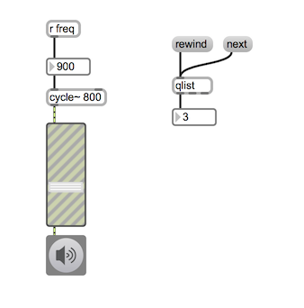
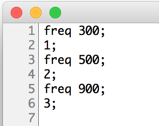

### Mehrere Parameter

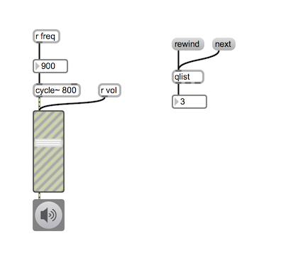
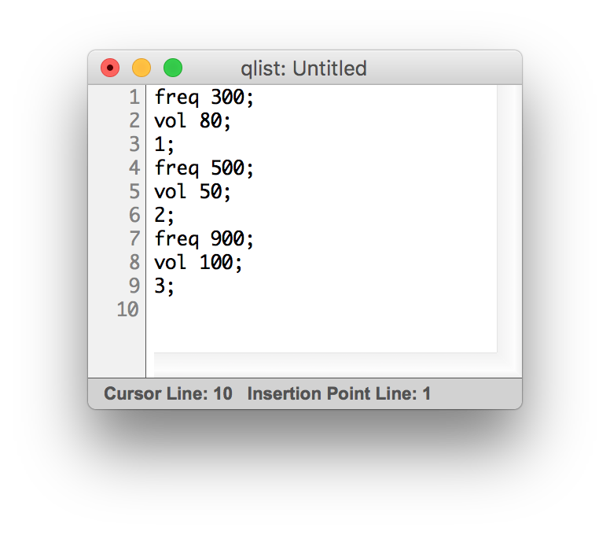

### Wie Qlist interpretiert den Text

- eine Zahl am Anfang einer Zeile ... stopp
- ein Symbol am Anfang einer Zeile ... fortsetzen

### Ausgabe

- man kann eine Liste mit mehreren Zahlen vom Outlet ausgeben

- man kann auch nach Zahlen Symbol schreiben
 und damit an ein "r"-Objekt eine Nachricht schicken.

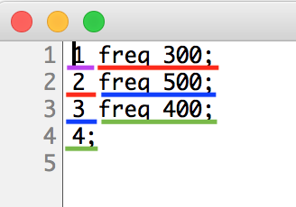

### Eine Sequenz mit Qlist
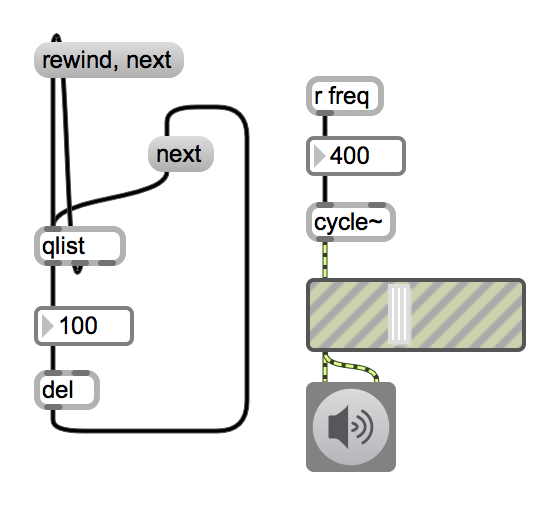
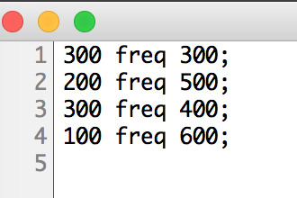

### Sequenz mit Unterbrechung

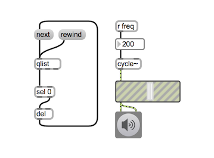
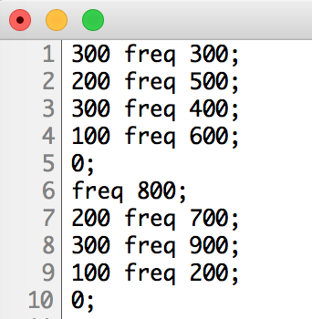

### Interpolation

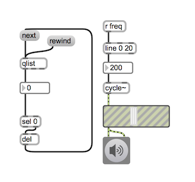
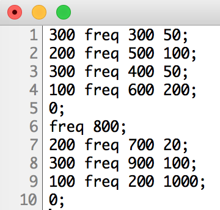

### Use Case
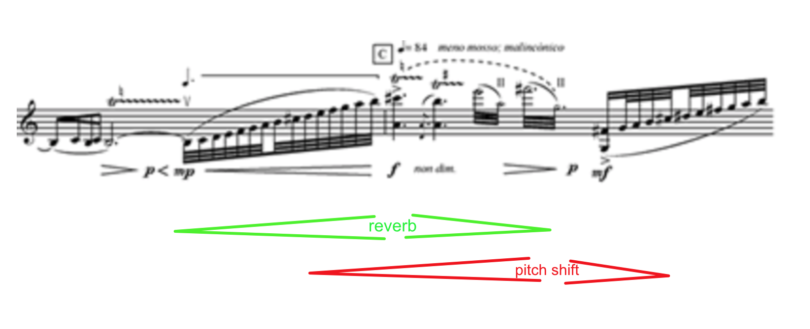

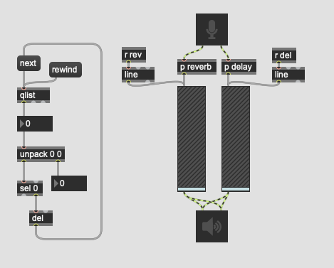
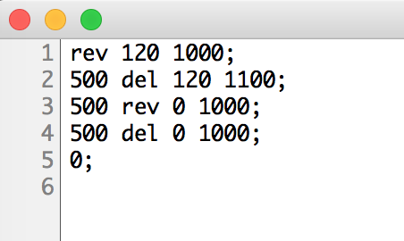

### Weitere Funktionen

### Qlist mit Sub-qlist

### Qlist mit Qlist Control

