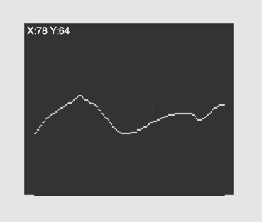
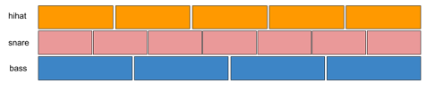
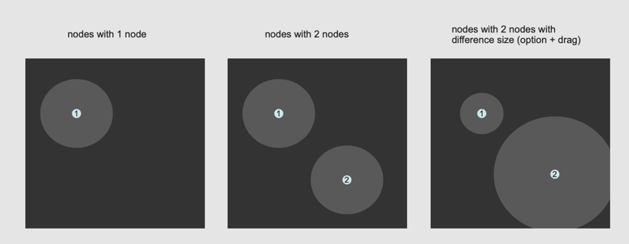
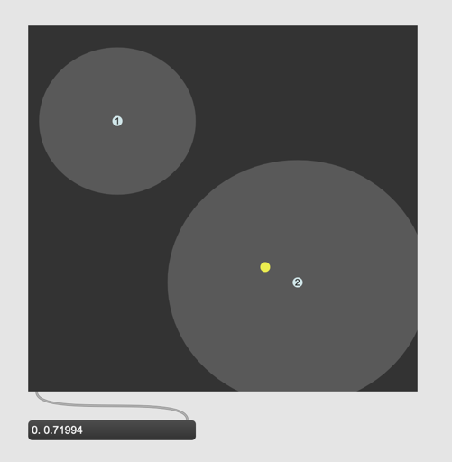

# K2 Automation with GUI (2)

## [itable] [table]

[itable] and [table] are very similar to buffer~. It stores values in memory.
itable, table and buffer~ can be editted by a mouse.
In terms of its 2 dimensionality function and itable are also very similar. if the user give X access, the object outputs the Y axis.

### Assignment 1: Difference

- What is the most essential difference between itable and buffer~?
- What is the most essential difference between itable and function?

### Assignment 2: Step sequencer

Make the [itable] whose X size is 16 Y size is 128.
Use a [metro 125] and [counter] object and count the number from 0 to 15 repeatedly.
Feed the number from counter to [itable] and let it output the corresponding Y number.
Each time [itable] outputs a number, playback a [snare drum](K2/snare.wav) sound interpreting the number between 0 and 127 as the volume of the snare drum. If the Y value is 0, the sample should be not triggered.

### Assignment 3: Drum machine
In the patch for Assignment2, load [bass drum](K2/bassdrum.wav) and [hihat](K2/hihat.wav) samples, add two more itables and create a simple drum machine that plays bass drum, snare drum, and hi-hat.

### Assignment 4: Phasing
Create a rhythmical phasing by changing the X size of snare drum to 12 (3 beats) and changing the X size of base drum to 20 (5 beats).

Hint: modulo (%) and infinite counting helps

### Assignment 5: Melody sequencer (advanced)

Add one more [itable] to the patch. The size of [itable] should X = 16 Y = 12 
and let it control the pitch and the volume of [saw~] between E3 and E4.

### Assignment 5: Probability control
Create a new patch with a button. When the button is clicked, one of three audio samples (snare drum, bass drum, and hi-hat) should be played back with the following probabilities.

- Snare drum: 25%
- Base drum: 35%
- Hi-hat: 40%

Implement this patch by studying futher the functionality of [itable]

## [nodes]

nodes GUI object displays nodes (circles) in a 2-D space and calculate the distance from the node point.

By moving the knob (yellow point), [nodes] reports the distance between the knob and the center of each node. If the knob doesn't enter the node, it reports 0.0.

In the following example, the knob is in the circle of node 2, and it is relatively close to the center, so it outputs "0.0 0.71994".

### Assignment 6: Waveform interpolation
Place three nodes in [nodes] object. Each node represents saw, square, and triangle wave.
By moving the knob, let the use freely mix those three waves.
The frequency of mixed wave should be fixed to 440 Hz.

Hint: [rect~][saw~][tri~]

### Assignment 7: Probability control using nodes
Review assignment 5. Implement the same idea using [nodes].

Hint: [iter][counter]

### Assignment 8: Automate the knob movement (Advanced)

The knob position can be controlled also programatically. Implement an algorithm to move the knob automatically. 

## [lcd]
[lcd] is a pre-jitter object to process images on Max.
The functionality of object is rudiment but the object would be sufficient for a simple image to sound conversion. 

### Assignment 9: Getting used to lcd

- Draw something on the LCD object with a mouse
- Draw something on the LCD object with commands such as printoval
- Write a text on the LCD object with the write command
- Load an image onto LCD

### Assignment 10: Mini-UPIC

Study [UPIC](https://en.wikipedia.org/wiki/UPIC) by Xenakis and listen to [Michena Alpha](https://www.youtube.com/watch?v=yztoaNakKok)

In the UPIC system, the X-axis is mapped to time and Y-axis is mapped to frequency. If the cursor detects a line it generates a synthesized sound.

Implement a simple version of this system using LCD and [ioscbank~]. The height of LCD has to me 300 pixel and use one oscillator per pixel.

Hint:
use getpixel message to get the information of each pixel.