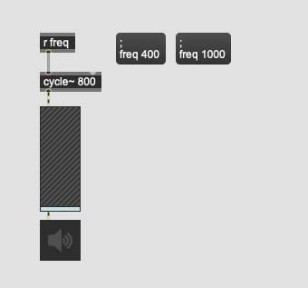
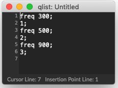
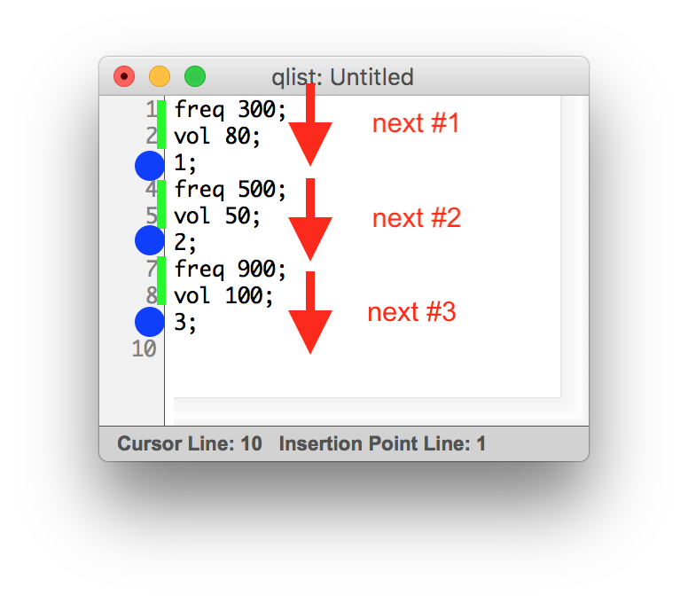
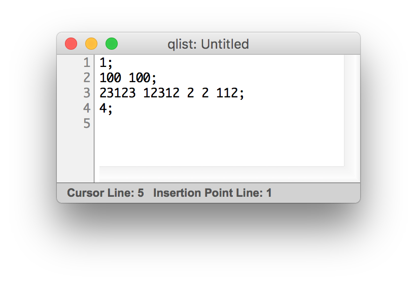
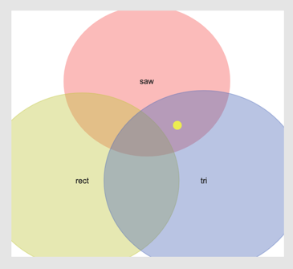
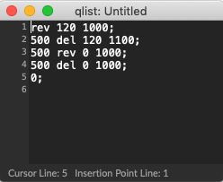
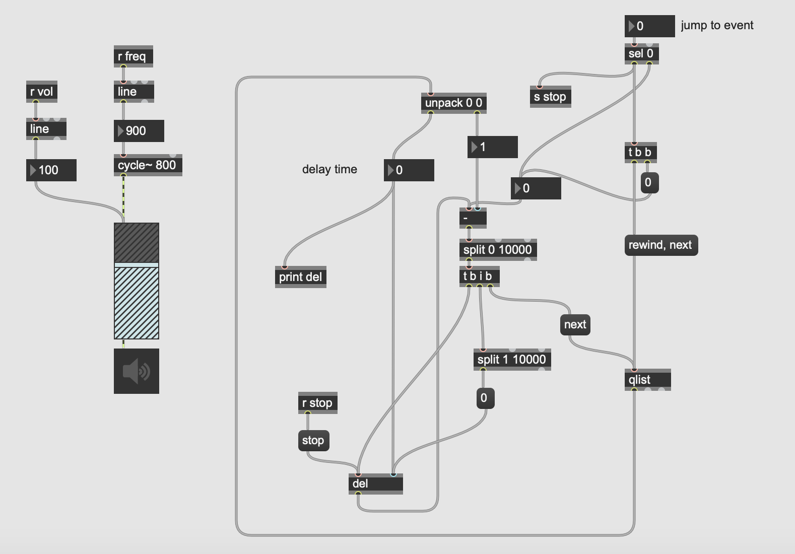
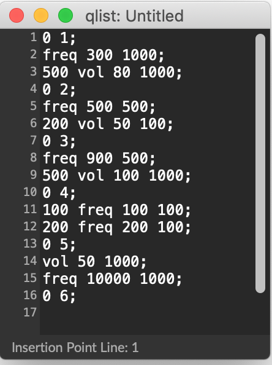
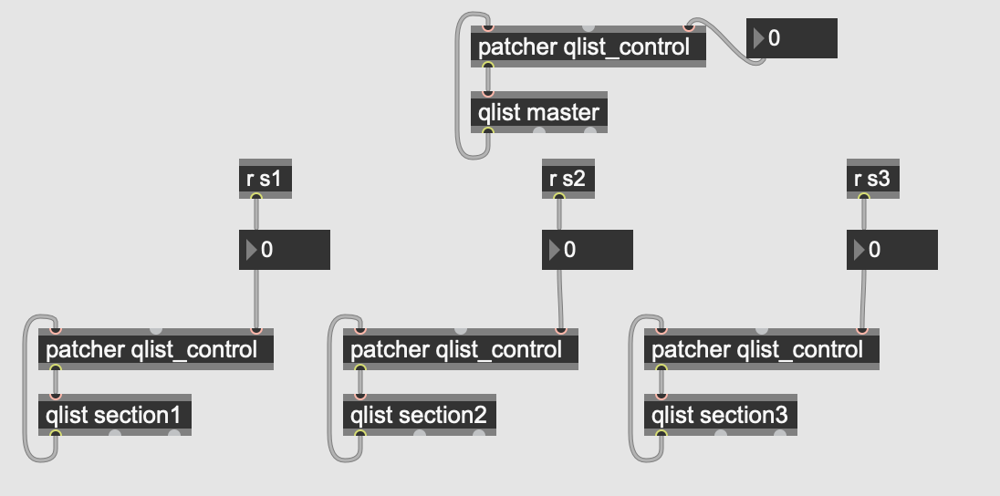

# Klasse 2

### Problem

- Parameteränderung in einem Live-Stück

### Message Box

### Message Box ohne Patchcord

### Qlist

### Mehrere Parameter

#### Interpretation von Text in einer qlist

- eine Zahl am Anfang einer Zeile ... stopp
- ein Symbol am Anfang einer Zeile ... fortsetzen

### Ausgabe

- man kann eine Liste mit mehreren Zahlen vom Outlet ausgeben

- man kann auch nach Zahlen Symbol schreiben
 und damit an ein "r"-Objekt eine Nachricht schicken.

### Interpolation

### Delay in einem Queue

#### Use Case

### Jump to queue (Nötig für Proben)

#### Qlist interfacing help patch

## Section Qlist

