# Klasse3

# pattrstorage

### pattr

patter und value
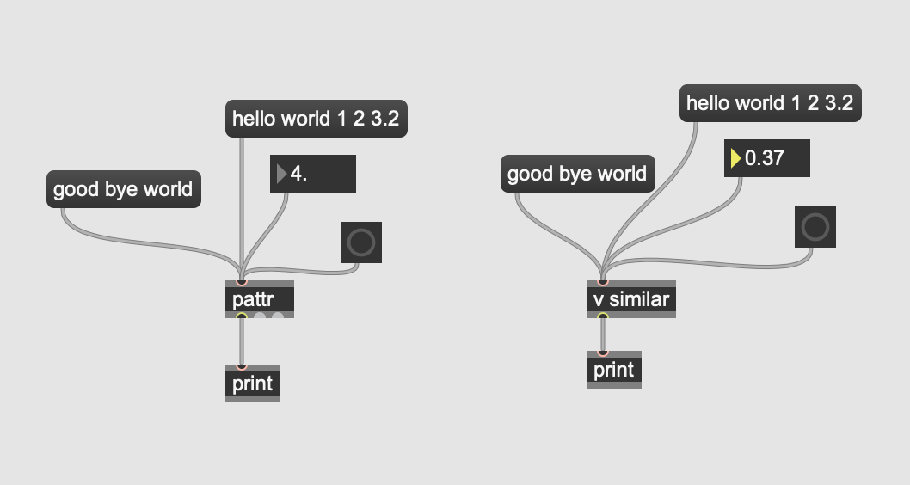

#### binding mit pattr
@bindto 

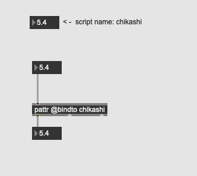

#### Typen (Vergleich mit send/receive und value)
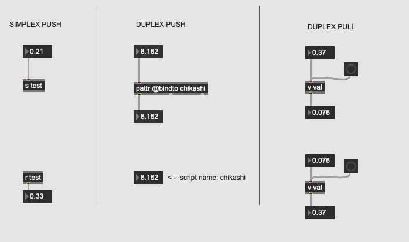

#### Mehrere pattr mit einzelnen GUI

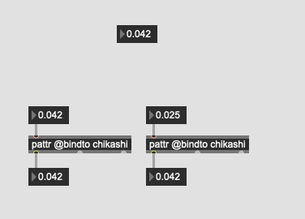

#### Mehrere Empfänger unmöglich
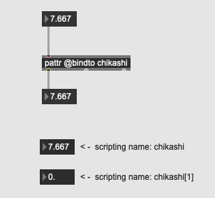

#### dynamische binding 

#### patcher und binding

##### sub patcher
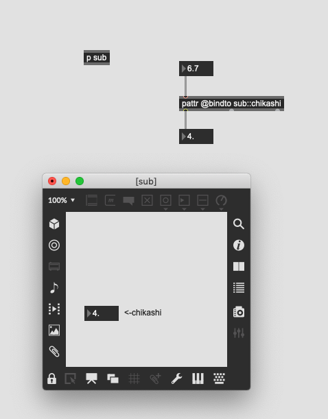

### pattrforward
fast gleich mit pattr

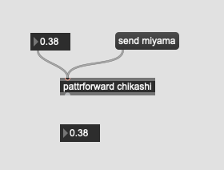

#### Untershied
##### Simplex
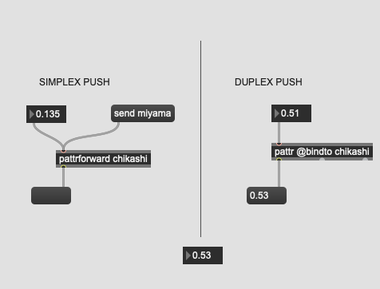

##### Super patcher
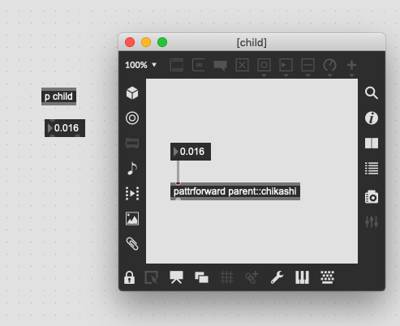

##### Interkation mit normalen Obejketen
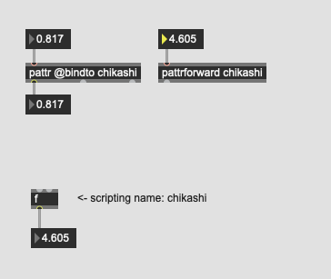

##### Selektion eines Eingangs
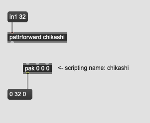

### pattrhub

Push/Pull pattr Zugriff

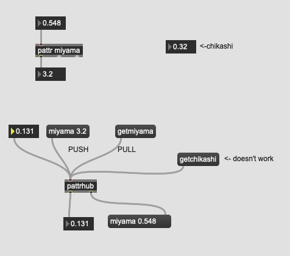

### autopattr
alle Objekte im Patcher im pattr-System

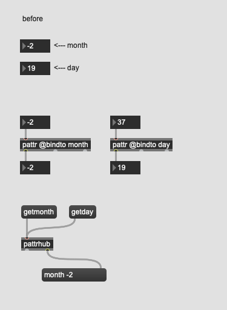

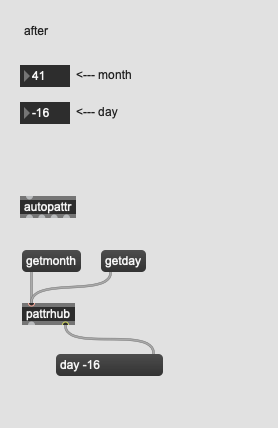

---
### autopattr und pattrstorage
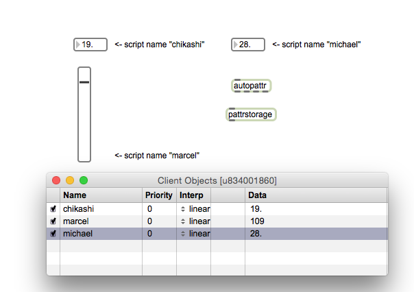
---
### preset funktion von pattrstorage
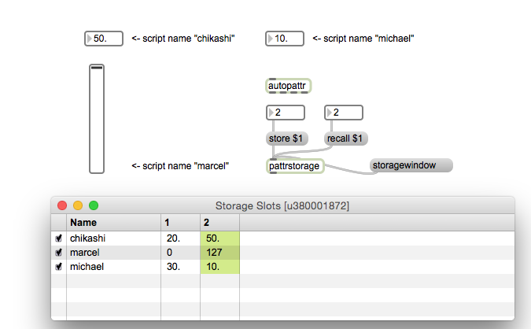
---
### interpolation mit pattrstorage
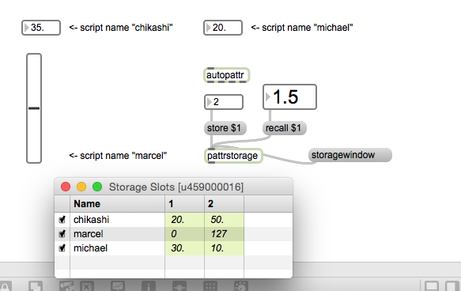
---
### Pattr und Subpatch
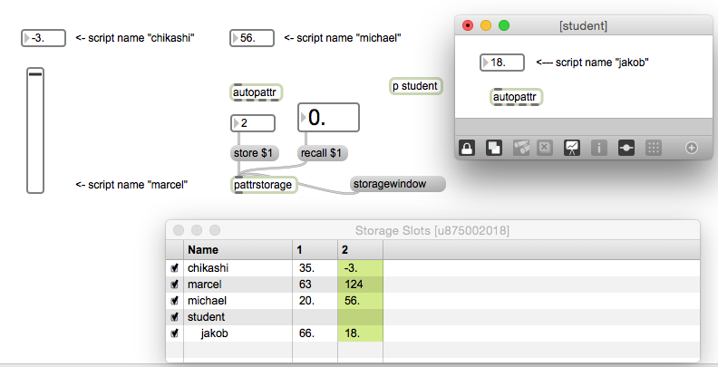
---
### Musikalische Anwendung
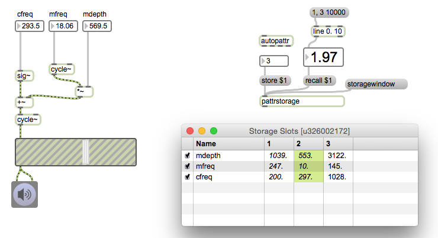 
