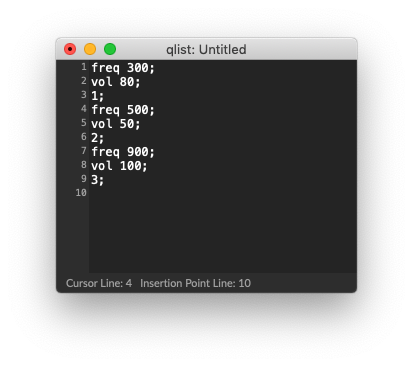
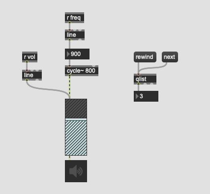
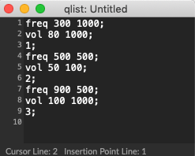
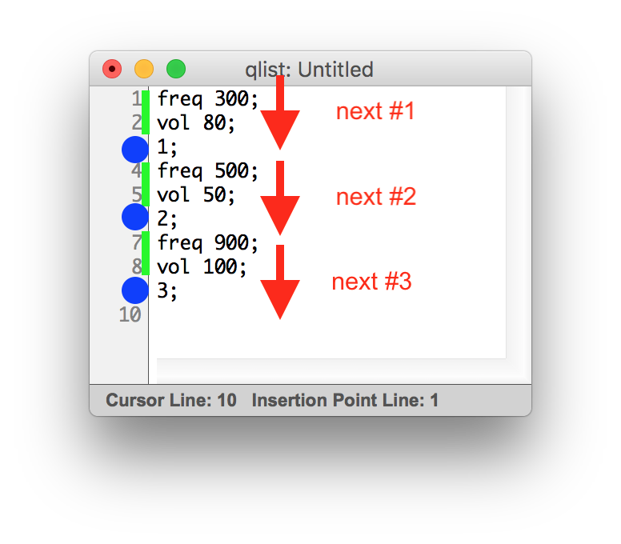

# Klasse 3: Qlist (1)

### Problem
We cannot change so many parameters in real time in a live performance. 
so we need to control them in an efficient manner.

- [preset] could be a bit too much bound to GUI objects
- [function] we need a lot of space in the patch

### Message Box

a message box is the most fundamental way to save fixed parameter in Max. It is similar to preset but
- we can see the number 
- we can use it without a GUI object
- we can see the association clearly (preset could control all GUI objects without a patchcord)

### Message Box without patchcord

with ; it is possible to send a value to designated [r] object

but if you want to send a lot of messages, you need a lot of message boxes on the patch and it is not scalable.

### Qlist

Qlist is the solution for the above-mentioned problem.
We can pack as many messages as we want in a qlist.

### Assignment 1: Your first qlist

Create a patch like the screenshot below and double-click the [qlist] object.
Write a qlist that sets the frequency in the following order.

200 Hz - 1200 Hz - 500 Hz - 2000 Hz

### Assignment 2: Many parameters at once

### Interpolation

#### Interpretation von Text in einer qlist

- eine Zahl am Anfang einer Zeile ... stopp
- ein Symbol am Anfang einer Zeile ... fortsetzen

### Nachteil von Qlist

- rewind bedeutet von Anfang
- keine graphische Anzeige; alles ist text

### Ausgabe

- man kann eine Liste mit mehreren Zahlen vom Outlet ausgeben
  
  

- man kann auch nach Zahlen Symbol schreiben
  und damit an ein "r"-Objekt eine Nachricht schicken.

### Delay in einem Queue

#### Use Case

## Qlist Control

### Qlist interfacing help patch

### Anatomie

#### Algorithm

#### Ohne delay

#### Mit delay

