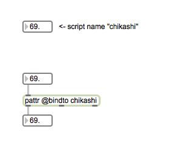
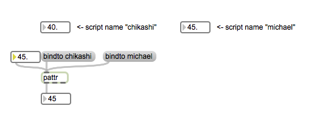
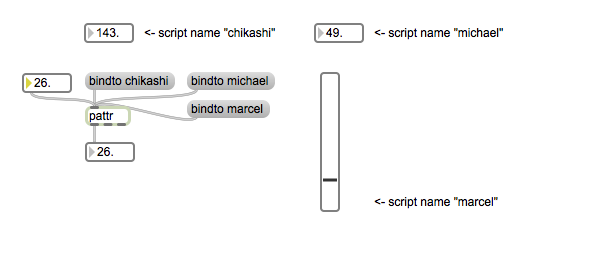

# Klasse3

# pattrstorage

### pattr

---
### bindto message

---
### slider als ein Target von bindto

---
### autopattr und pattrstorage

---
### preset funktion von pattrstorage

---
### interpolation mit pattrstorage

---
### Pattr und Subpatch

---
### Musikalische Anwendung
 
