# Klasse 2

### Problem

- Parameteränderung in einem Live-Stück

### Message Box
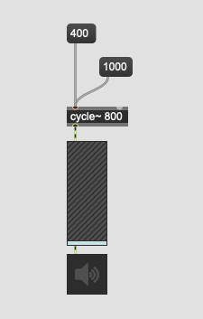

### Message Box ohne Patchcord

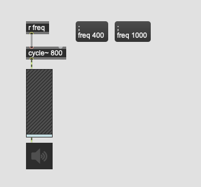

### Qlist

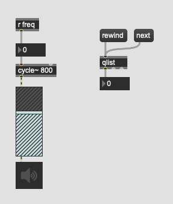
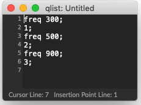

### Mehrere Parameter

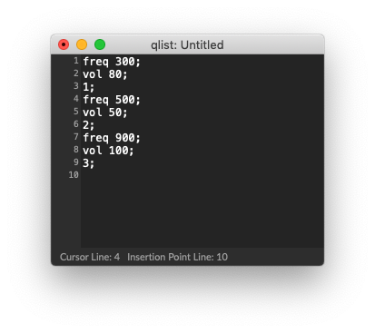

### Interpolation

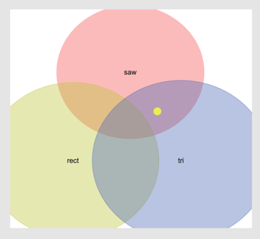
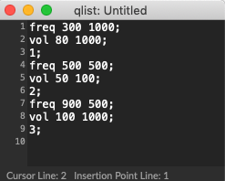

#### Interpretation von Text in einer qlist

- eine Zahl am Anfang einer Zeile ... stopp
- ein Symbol am Anfang einer Zeile ... fortsetzen

### Nachteil von Qlist

- rewind bedeutet von Anfang
- keine graphische Anzeige; alles ist text

### Ausgabe

- man kann eine Liste mit mehreren Zahlen vom Outlet ausgeben
  
  

- man kann auch nach Zahlen Symbol schreiben
  und damit an ein "r"-Objekt eine Nachricht schicken.

### Delay in einem Queue

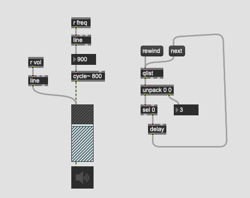
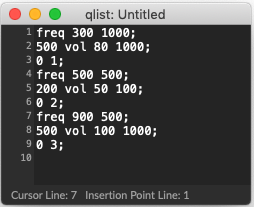

#### Use Case

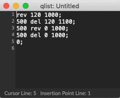

## Qlist Control

### Qlist interfacing help patch
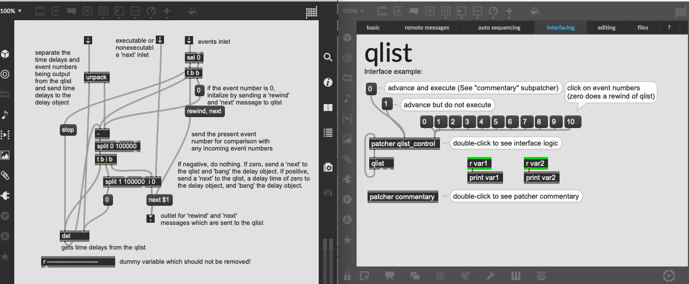

### Anatomie

#### Algorithm
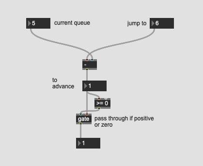

#### Ohne delay
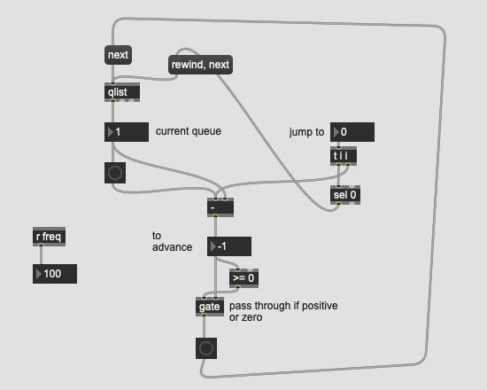
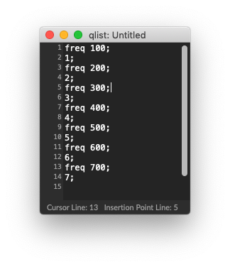

#### Mit delay

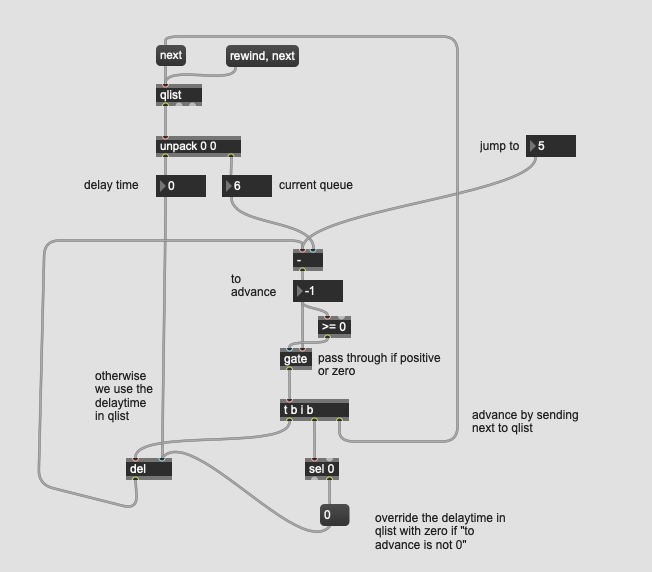
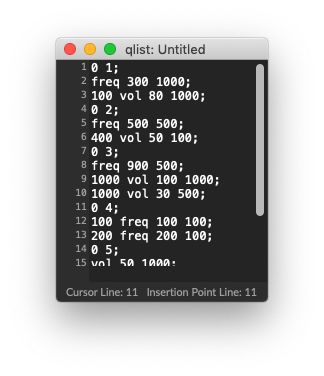

## Section Qlist

