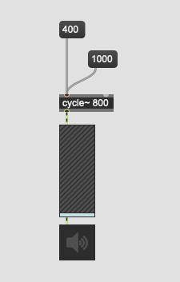
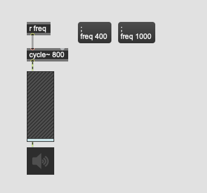
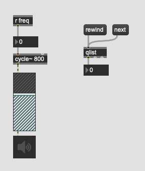
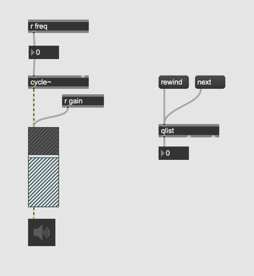

# Klasse 3: Qlist (1)

### Problem
We cannot change so many parameters in real time in a live performance. 
so we need to control them in an efficient manner.

- [preset] could be a bit too much bound to GUI objects
- [function] we need a lot of screen space in the patch to automate everything using graphs

### Message Box

a message box is the most fundamental way to save fixed parameter in Max. It is similar to [preset], but it has its own advantages.

- we can see constant numbers 
- we can use it without a GUI object
- we can see the association clearly (preset could control all GUI objects without a patchcord)

### Message Box without patchcord

with ; it is possible to send a value to designated [r] object

but if you want to send a lot of messages, you need a lot of message boxes in the patch, and it would be not scalable.

### [qlist]

[qlist] is the solution for the above-mentioned problems.  We can pack as many messages as we want in a [qlist] object.

### Assignment 1: Your first qlist

Create a patch like the screenshot below and double-click the [qlist] object.
Write a qlist that sets the frequency in the following order.

200 Hz - 1200 Hz - 500 Hz - 2000 Hz

### Assignment 2: Many parameters at once

[qlist] can send multiple messages per queue.
Add [r gain] to the patch and control gain along the frequency.

|      | 1   | 2    | 3   | 4    |
|------|-----|------|-----|------|
| freq | 200 | 1200 | 500 | 2000 |
| gain | 50  | 80   | 80  | 30   |

### Assignment 3: Interpolation

Until now, all parameters are set instantly without any ramps, fades or interpolations. However, it is possible to send multiple number from [qlist] to [r] object. This means by adding [line] object, we can easily realize the interpolation between the current and the target value with specified durations.

add two line objects to the patch and apply interpolations to each transition as follows.
The second number in each cell represents the time in ms for the interpolation.

|      | 1       | 2         | 3       | 4         |
|------|---------|-----------|---------|-----------|
| freq | 200 500 | 1200 1000 | 500 400 | 2000 3500 |
| gain | 50 2000 | 80 500    | 80 200  | 30 4500   |

### The problems of qlist

1. Only text. It's hard to grasp the transition of parameters intuitively (compared to function)
2. If very complex change of parameters should be executed in a short amount of time, we have to prepare many queues and advance the queues rapidly (see the snippet of the score below, to realize the reverb and pitch shift effects fade-in/out we need 4 queues)
3. "rewind" actually rewinds the entire qlist. It's hard to rehearse the piece from a middle section of a composition.

### Assignment 4: Delayed execution
Consider the solution for the above-mentioned problem No. 2 and the score above.  
It is possible to advance four queues in a short amount of time but

| queue       | 1       | 2       | 3      | 4      |
|-------------|---------|---------|--------|--------|
| reverb      | 80 1000 |         | 0 1000 |        |
| pitch shift |         | 80 1000 |        | 0 1000 |

it would be also convenient to execute three following queues automatically with designated delay times.

| queue       | 1       |         |        |        |
|-------------|---------|---------|--------|--------|
| delay (ms)  |         | 1000    | 1000   | 1000   |
| reverb      | 80 1000 |         | 0 1000 |        |
| pitch shift |         | 80 1000 |        | 0 1000 |

Implement delayed execution system by extending the patch for assignment 3.

Hints: Study the qlist's very unique behaviour 
1. qlist outputs the first element of the line from its outlet if it is a number.
2. qlist outputs the second element of the line from its outlet along with the first element if the second element is also the number.
3. qlist interprets the first symbol element in the line as the receiver of the message
4. if the first element of the line is a symbol, qlist sends the message and execute the next line

### Assignment 5: Qlist control (advanced)

Consider the solution for the problem number 3 (rewind message rewinds the queue to real beginning)
