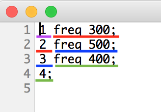

# Klasse 3: Qlist (1)

### Problem
We cannot change so many parameters in real time in a live performance. 
so we need to control them in an efficient manner.

- [preset] could be a bit too much bound to GUI objects
- [function] we need a lot of space in the patch

### Message Box

a message box is the most fundamental way to save fixed parameter in Max. It is similar to preset but
- we can see the number 
- we can use it without a GUI object
- we can see the association clearly (preset could control all GUI objects without a patchcord)

### Message Box without patchcord

with ; it is possible to send a value to designated [r] object

but if you want to send a lot of messages, you need a lot of message boxes on the patch and it is not scalable.

### Qlist

Qlist is the solution for the above-mentioned problem.
We can pack as many messages as we want in a qlist.

### Assignment 1: Your first qlist

Create a patch like the screenshot below and double-click the [qlist] object.
Write a qlist that sets the frequency in the following order.

200 Hz - 1200 Hz - 500 Hz - 2000 Hz

### Assignment 2: Many parameters at once

qlist can send multiple messages per each queue.
add [r gain] to the patch and control gain along the frequency.

|      | 1   | 2    | 3   | 4    |
|------|-----|------|-----|------|
| freq | 200 | 1200 | 500 | 2000 |
| gain | 50  | 80   | 80  | 30   |

### Assignment 3: Interpolation

Until now, all parameters are set instantly without any ramps, fades or interpolations. However, it is possible to send multiple number from qlist to [r] object. This means by adding [line] object, we can easily realize the interpolation between the current and the target value without specified speed.

add two line objects to the patch and apply interpolations to each transition as follows.
The second number in each cell represents the time in ms for the interpolation.

|      | 1       | 2         | 3       | 4         |
|------|---------|-----------|---------|-----------|
| freq | 200 500 | 1200 1000 | 500 400 | 2000 3500 |
| gain | 50 2000 | 80 500    | 80 200  | 30 4500   |

### Nachteil von Qlist

- rewind bedeutet von Anfang
- keine graphische Anzeige; alles ist text

### Ausgabe

- man kann eine Liste mit mehreren Zahlen vom Outlet ausgeben
  
  

- man kann auch nach Zahlen Symbol schreiben
  und damit an ein "r"-Objekt eine Nachricht schicken.

### Delay in einem Queue

#### Use Case

## Qlist Control

### Qlist interfacing help patch

### Anatomie

#### Algorithm

#### Ohne delay

#### Mit delay

