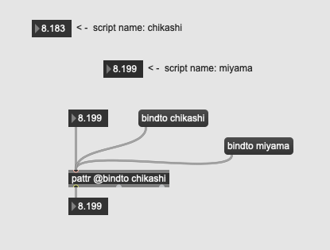

# Klasse3

# pattrstorage

### pattr

patter und value

#### binding mit pattr
@bindto 

#### Typen (Vergleich mit send/receive und value)

#### Mehrere pattr mit einzelnen GUI

#### Mehrere Empfänger unmöglich

#### dynamische binding 

#### patcher und binding

##### sub patcher

### pattrforward
fast gleich mit pattr

#### Untershied
##### Simplex

##### Super patcher

##### Interkation mit normalen Obejketen

##### Selektion eines Eingangs

### pattrhub

Push/Pull pattr Zugriff

### autopattr
alle Objekte im Patcher im pattr-System

---
### autopattr und pattrstorage

---
### preset funktion von pattrstorage

---
### interpolation mit pattrstorage

---
### Pattr und Subpatch

---
### Musikalische Anwendung
 
