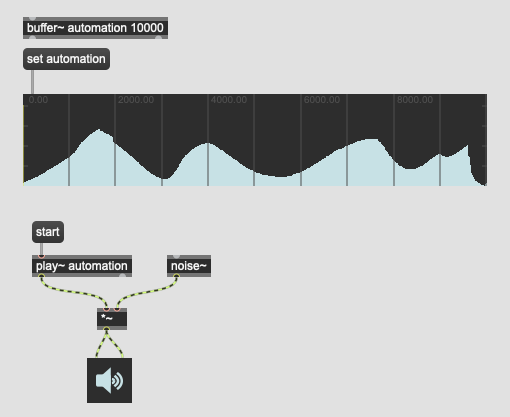

# Automation mit MIDI

MIDI ... Musical Instrument Digital Interface

## MIDI Objekte in Max

## MIDI Sequencer in Max

### detonate

## Kontrol mit DAW

## Automation mit Audio

### Extrem prezise, keine Latenz

### Audio Feature Extraction als Automation

### "Bang" mit audio / Analog Synti

- Ch 1-2 ... Audio
- Ch 3 ... Impulse (Audio Bangs)

