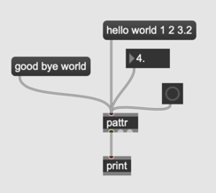
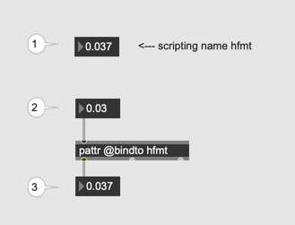
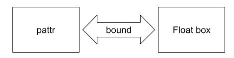
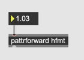
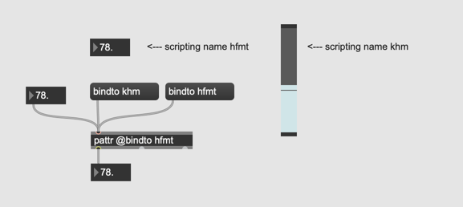
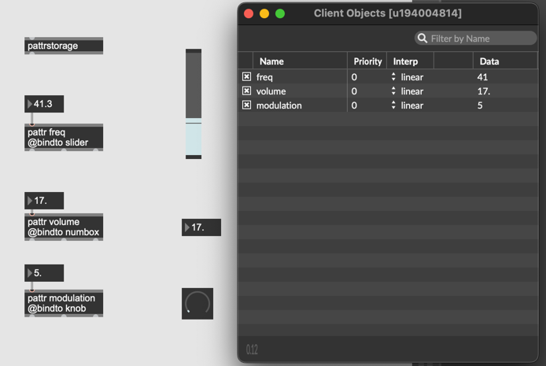
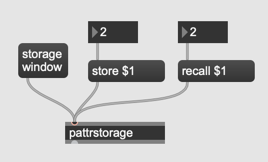

# K4 pattr

### [pattr]

stores its own data, or binds to another object to share its contents with other pattr-based objects.

### Assignment 1: pattr basic

Implement the following patch and compare it with the behaviour of [value] or [send][receive].

### Assignment 2: The concept of data binding

create a float number box and set its scripting name to "hfmt".
make a pattr object with an attribute @bindto hfmt
Change the value of 3 float number boxes and check the behaviour.

The important thing here is that two objects are bound to each other.  
If one of them is update, the other is also updated immeditely.

### Assignment 3: Multi-bound

in the patch of Assignment 2. 
- make one more float box, and name it "hfmt"
- make one more pattr and bind it to "hfmt"

See how those additional objects behave upon the change of shared data.

### Assignment 4: pattrforward

in the patch of assignment 2, add an [pattrforward hfmt] object, send a float number to it, and check the behaviour of other objects. Discuss the functionality of pattrforward in the context of data binding.

### Assignment 5: partner exchange

In the patch of assignment 3, add one slider, set the slider's scripting name to "khm",
send pattr object "bindto khm" message, and send some float number to pattr.

### Assignment 6: pattr storage
In the patch of assignment 5, name the pattr object,
make [pattrstorage] object and open it by double-clicking the object.
Change the value of pattr and observer how the data cell of the client object list reacts.

### Assigment 7: autopattr
The problem of assignment 6 is that we need more and more pattr objects in case we want to expose a lot of GUI objects in the pattr world. 

[autopattr] object helps this cluttering problems by communicating to all named GUI objects in the patch.

Implement the following patch below in which all GUI objects are bound to Individual and replace all pattr objects using one autopattr.

Discuss what is the pros and cons of this approach.

### Assignment 8: storage window

In the patch of assignment 7, add "storagewindow", "recall $1", and "store $1" messages to the patch and connect them to pattrstroage object. 
Save some presets using store messages and load the save presets using recall messages.

### Assignment 9: Interpolation
In the patch of assignment 8,  use floating point number box instead of integer box for recall message and see what happens, when a floating point number is sent to pattrstorage.

### Assignment 10: patcher and pattr 

In the patch of assignment 9, make a patcher and name it.
In the patcher, instantiate one float box, name the box, and put an autopattr.
How is this newly added float box in the patcher handled in pattrstorage?

### Assignment 11: pattr vs qlist

Discuss the pros and cons of pattr in comparison with qlist.