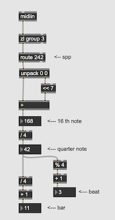

# Automation mit MIDI

MIDI ... Musical Instrument Digital Interface

## MIDI Spec

[MIDI website](https://www.midi.org/)

## Prinzip

- Status Byte ... MSB 1 
- Data Byte 1 ... MSB 0
- Data Byte 2 ... MSB 0

MSB (Most Significant Bit)

### Rheinfolge ist wichtig

## MIDI Objekte in Max

- midiinfo ... midi hardware info
- midiin ... raw midi in
- midiout ... raw midi out
- bendin ... pitch bend in
- bendout ... pitch bend out
- notein ... note in
- noteout ... note out
- ctlin ... control in
- ctlout ... control out
- pgmin ... program change in
- pgmout ... program change out
- sysexin ... system exclusive in
- midiparse ... raw midi -> mehere Outlets
- midiformat ... mehrere Inlets -> raw midi
- midiselect ... midiparse + filter
- rtin ... midi realtime message

#### Realtime message

[MIDI Realtime Message](https://www.recordingblogs.com/wiki/midi-system-realtime-messages)

[MIDI Status Byte](https://www.midi.org/specifications-old/item/table-2-expanded-messages-list-status-bytes)

MIDI system realtime messages are messages that are not specific to a MIDI channel but prompt all devices on the MIDI system to respond and to do so in real time.

A MIDI system realtime message – usually the MIDI clock message – can be placed *in the middle of another message without affecting this other message* or changing the MIDI running status. The realtime message can be recognized and handled appropriately, because its status byte has a topmost bit equal to 1, whereas the bytes of MIDI message data after the status byte have topmost bytes equal to 0, and because the length of system realtime messages is known.

#### experiment

## Kontrol mit DAW

### to Max 1 als DAW MIDI OUT

### to Max 1 als MIDI IN

### Wiedergabe in DAW

### in Max

## Synchronisierung mit MIDI

- MMC (MIDI Machine Control) ... start stop
- SPP (Song Position Pointer) ... schickt die genaue Position des Abspielkopfes
- MIDI Clock (MIDI Clock) ... Tempo abhägig clock
- MTC (MIDI Time Code) ... time code für Synchronisierung mit Video

Es gibt keine offizielle MIDI message für "Tempo" oder "Zeitstempel".

[Tweakhead Webseite](K4/https://www.tweakheadz.com/sync_mmc_mtc_smpte.htm)

## Max als Sync Slave

### MMC (MIDI Machine Control)

- start (Status Byte 250 / realtime)
- stop (Status Byte 252 / realtime)
- continue (Status Byte 251 / realtime)

### MIDI Clock 

- clock (Status Byte 248 / realtime)

#### MIDI Clock Hardware
[MIDI Clock - e-rm](https://www.e-rm.de/midiclock/)

### SPP (Song Position Pointer)

- Status Byte - 242
- Data Byte1	- MIDI Beats1
- Data Byte2	- MIDI Beats2

1 MIDI beat = sechzehntel

### MTC (MIDI Time Code)

#### zwei typen 

##### Full time code (Wenn der Abspielkopf springt)

F0 7F 7F 01 01 *hh mm ss ff* F7

- F0 - 240 ... System Exclusive
- 7F ... real-time universal message
- 7F ... global broadcast
- 01 ... time code type
- 01 ... full time code
- hh ... hour
- mm ... minutes
- ss ... seconds
- ff ... frame
- F7 - 247 ... End of System Exclusive

##### Quarter Frame time code

## Max als Sync Master

### MMC

### MIDI Clock

### SPP

### MTC

## MIDI Sequencer in Max

### seq

### detonate

## Automation mit Audio

### Extrem prezise, keine Latenz

### Audio Feature Extraction als Automation

### "Bang" mit audio / Analog Synti

- Ch 1-2 ... Audio
- Ch 3 ... Impulse (Audio Bangs)

