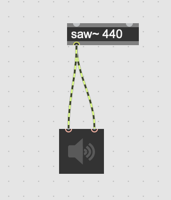

# K5 Automating parameters with randomness

## Randomness in the control world

The random control in control world allows you to implement variety of logics to control randomness.

### Assignment 1: Random Frequency

using [random] object, randomize the frequency of saw~ wave every one second in the patch below.
The range of the frequency should be 440 and 880.

Hint: [metro]

### Assignment 2: Random Pitch

In the patch for assignment 1, restrict the randomly generated frequency to the frequency of well-tempered scale between A4 and A5.

### Assignment 3: No successive output

In the patch assignment 2, avoid the successive use of the same frequency. If the random frequency generator outputs C5 (523.251131 Hz) the next randomly generated frequency should be the different one.

### Assignment 4: Exhaustive output

In the patch for assignment 2, there are 13 possible random frequencies to be generated.
Implement a random number generator that outputs those 13 frequencies without any duplications until it exhausts all possible random frequencies.

e.g. 
The random generator should not generate [440] [523.2511] and again [440].

Hint: [uran]

### Assignment 5: Probability control

in the patch for assigment 3, Use [itable] and control the probability of each random frequency

## Randomness in the audio world

Randomness in the audio world helps to add different nuances to the sound.
The techniques introduced here are very similar to the techniques for analog modular sysnthesizer.

### Assignment 6: rand~

with [rand~], randomize the frequency of [saw~] the range of randomization should between 440 and 880 Hz.
The frequency of randomization should be 5 Hz.

### Assignment 7: no interpolation

[rand~] generates a linearly interpolated random signal between -1 and 1. Find a way to generate non-interpolated random signal using [noise~] and make the patch for assignment 6 non-interpolated.
The output sound should be exactly the same as that of assignment 1 (updated every second)

Hint: [sah~]

### Assignment 8: Adding interpolation again 

On top of the patch for assignment 7, apply interpolation using [rampsmooth~] to generate exactly the same sound as assignment 6.

### Assignment 9: [slide~]

replace [rampsmooth~] with [slide~] and listen to the difference

### Assignment 10: Creative modulation (advanced)

By combining multiple random generator fluctuate the frequency of saw~ with your own unique way.

