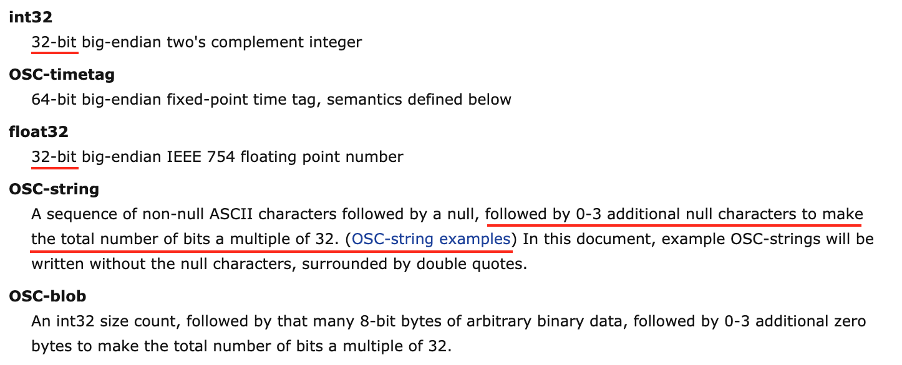
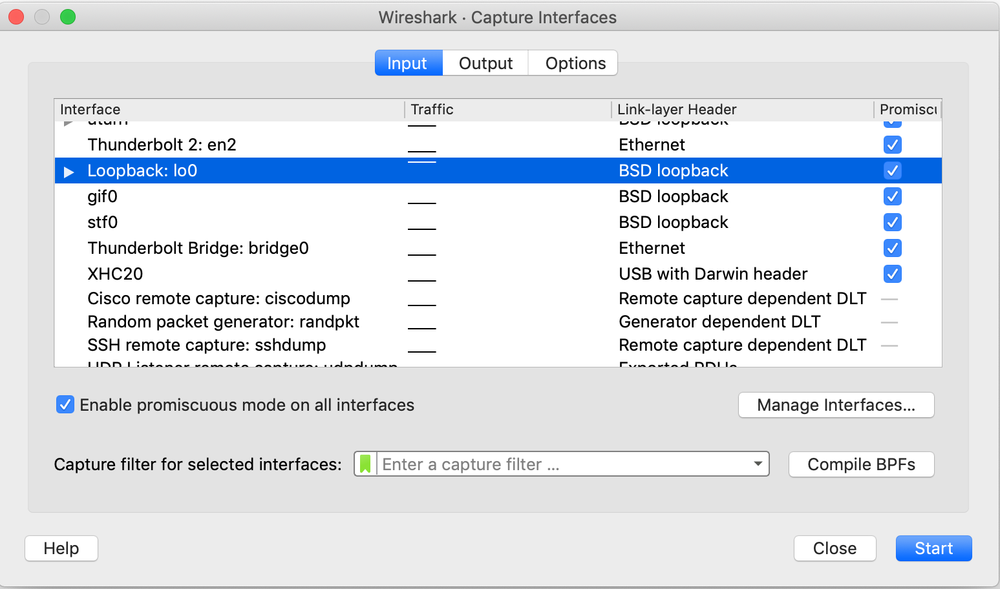
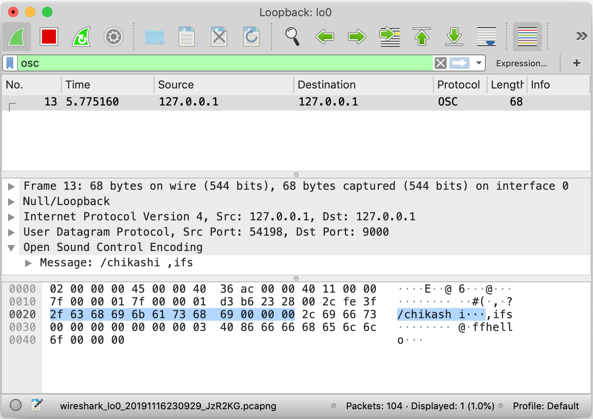
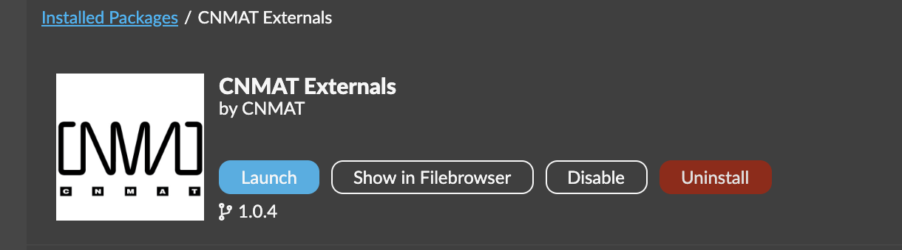
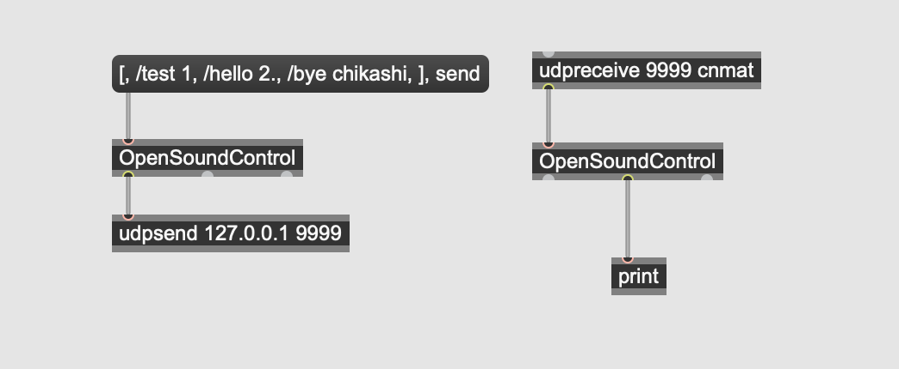
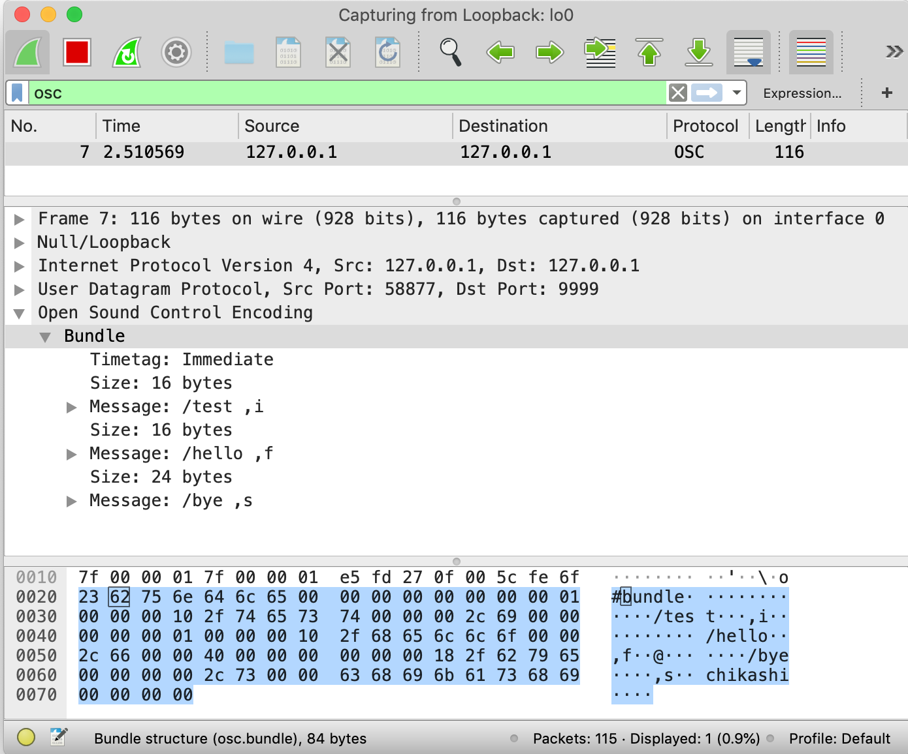

# Automation mit OSC

## Basis 

### IPAdresse

Eine IP-Adresse ist eine Adresse in Computernetzen, die – wie das Internet – auf dem Internetprotokoll (IP) basiert. Sie wird Geräten zugewiesen, die an das Netz angebunden sind, und macht die Geräte so adressierbar und damit erreichbar. Die IP-Adresse kann einen einzelnen Empfänger oder eine Gruppe von Empfängern bezeichnen (Multicast, Broadcast). 

### Port

[Port-Nummer](https://en.wikipedia.org/wiki/List_of_TCP_and_UDP_port_numbers)

# OSC webseite
[opensoundcontrol.org](http://opensoundcontrol.org)

Open Sound Control (OSC) is a protocol for communication among computers, sound synthesizers, and other multimedia devices that is optimized for modern networking technology. Bringing the benefits of modern networking technology to the world of electronic musical instruments, OSC's advantages include interoperability, accuracy, flexibility, and enhanced organization and documentation.

[Osc Compatible Software](http://opensoundcontrol.org/implementations)

[Osc Specification](http://opensoundcontrol.org/spec-1_0)

## OSC Packets

The unit of transmission of OSC is an **OSC Packet**. 

An OSC packet consists of its contents, a contiguous block of binary data, and its size, the number of 8-bit bytes that comprise the contents. **The size of an OSC packet is always a multiple of 4.**

The underlying network that delivers an OSC packet is responsible for delivering both the contents and the size to the OSC application. An OSC packet can be naturally represented by a datagram by a network protocol such as **UDP**.

The contents of an OSC packet must be either an **OSC Message** or an **OSC Bundle**.

The first byte of the packet's contents unambiguously distinguishes between these two alternatives.

### Message mit OSC in Max

### shell and say

### WireShark (Netzwerk Analysator)

[WireShark](https://www.wireshark.org)

## Beispiele
Mit OSC kann man mit einer Software eine andere Software relativ einfach steuern.

### Max steuert Reaper

### iPad steuert Max

[Touch OSC](https://hexler.net/products/touchosc)

### Osc Compatibel Verraumlichung-System

[Sonic Emotion - Wave1](https://www2.sonicemotion.com/professional/)

## CNMAT External

### OSC Bundle

## IanniX (Osc Auitomation Sequencer)

### 1. Smooth Curve

### 2. Werte von IanniX

### 3. Einstellung von Cursor

### 4. Trigger

### 5. Mehrere Zeiger

### 6. 3 Dimension

Alt + Drag

