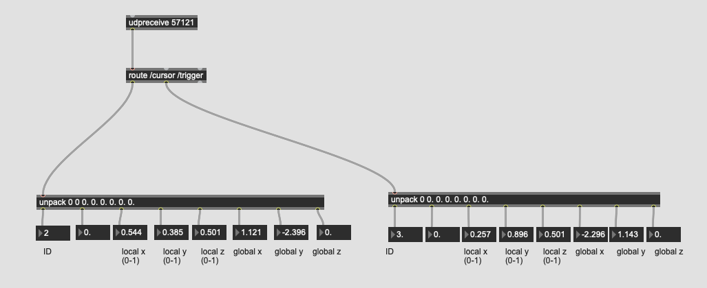

# Automation mit OSC

[opensoundcontrol.org](http://opensoundcontrol.org)

Open Sound Control (OSC) is a protocol for communication among computers, sound synthesizers, and other multimedia devices that is optimized for modern networking technology. Bringing the benefits of modern networking technology to the world of electronic musical instruments, OSC's advantages include interoperability, accuracy, flexibility, and enhanced organization and documentation.

[Osc Compatible Software](http://opensoundcontrol.org/implementations)

[Osc Specification](http://opensoundcontrol.org/spec-1_0)

## Hack projekt
### IPAdresse

Eine IP-Adresse ist eine Adresse in Computernetzen, die – wie das Internet – auf dem Internetprotokoll (IP) basiert. Sie wird Geräten zugewiesen, die an das Netz angebunden sind, und macht die Geräte so adressierbar und damit erreichbar. Die IP-Adresse kann einen einzelnen Empfänger oder eine Gruppe von Empfängern bezeichnen (Multicast, Broadcast). 

### Port

[Port-Nummer](https://en.wikipedia.org/wiki/List_of_TCP_and_UDP_port_numbers)

### Message mit OSC in Max

### shell and say

## Beispiele
Mit OSC kann man mit einer Software eine andere Software relativ einfach steuern.

### Max steuert Reaper

### iPad steuert Max

[Touch OSC](https://hexler.net/products/touchosc)

### Osc Compatibel Verraumlichung-System

[Sonic Emotion - Wave1](https://www2.sonicemotion.com/professional/)

## IanniX (Osc Auitomation Sequencer)

### 1. Smooth Curve

### 2. Werte von IanniX

### 3. Einstellung von Cursor

### 4. Trigger

### 5. Mehrere Zeiger

### 6. 3 Dimension

Alt + Drag

