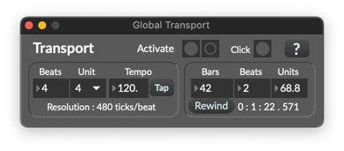
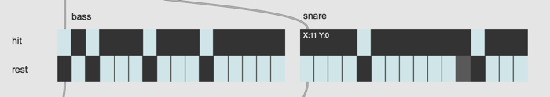

# K6 Automation with Global Transport

If Max knows the current playback position of the piece (e.g. in prelude, thema exposition, development or coda, bar N beat M ? ), it would be possible to associate parameters with them.

In a beat-based piece, it would be also helpful that Max understand the concept of bar/beats, so that we can associate parameters with the information.

### Global Transport Button

### Global Transport Menu

- it is possible to specify bars and beat and (re)activate the transport
- once beats or unit are changed, the transport is reset
- by enabling "click" the beats can be heard

### Assignment 1: [when]

- Open Global transport panel and set some numbers in the bars and beats number box
- Create a new patch, instantiate [when] object, and send a bang to it
- Observe the output from the [when] object
- instantiate multiple [when] objects and check the output

### Assignment 2: [transport]

- Open Global transport panel and set some numbers in the bars and beats number box
- Create a new patch, instantiate [transport] object, and send a bang to it
- Observe the output from the [transport] object
- instantiate multiple [transport] objects and check the output

### Assignment 3: rhythmic sync

Study [metro] object again and play hi-hat every 16th note in sync with global transport using [metro].
The [hi-hat](K6/hihat.wav) should be played only when the global transport is enabled.

### Assignment 4: itable sync

Create an itable-based sequencer for [bass drum](K6/bassdrum.wav) and [snare drum](K6/snare.wav) whose
x-range should be 16 y-range should be 2. sync them with the global transport.

### Assignment 5: riff sync

Create an itable for a riff (row=12/column=16 range between E3 and E4), play the riff in sync with global transport.

### Assignment 6: riff transport

Transpose the riff in the following manner

| bar       | 1-4 | 5-8 | 9-12 | 13-16 |
|-----------|-----|-----|------|-------|
| transpose | 0   | + 5 | + 7  | 0     |

### Assignment 7: Cymbals

Study [timepoint] object and play the [cymbal](K6/cymbal.wav) sound at the beginning of bar 4 and 12.

