# Time in Max

## Objekte

### clocker?

metro + counter

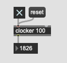

### Global Transport Button
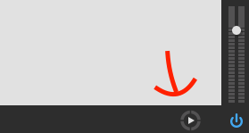

### Global Transport Menu

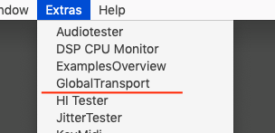

### Transport Object

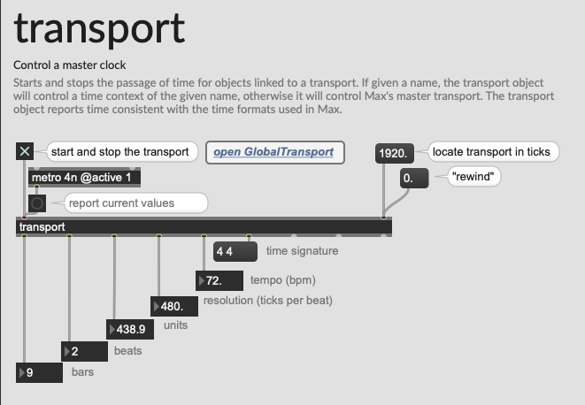

#### Beispiel

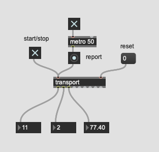

#### Trigger ein Event mit transport

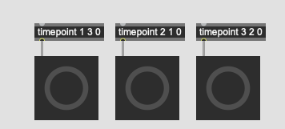

#### Metro als slave (Click track generator)

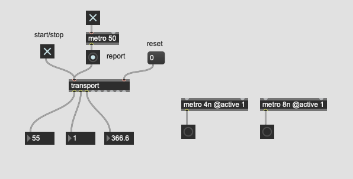

#### Global transport checken

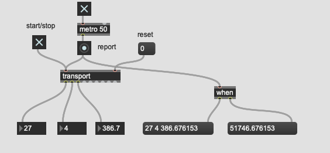

#### Zwei Instanzen

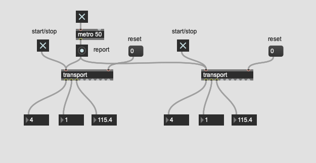

Zwei Instanzen von "transport" synchronisieren miteinander.

##### mit "Name"

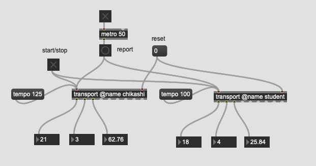

##### sync mit Lokal

### Partitur mit transport

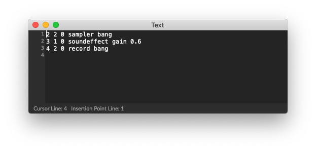

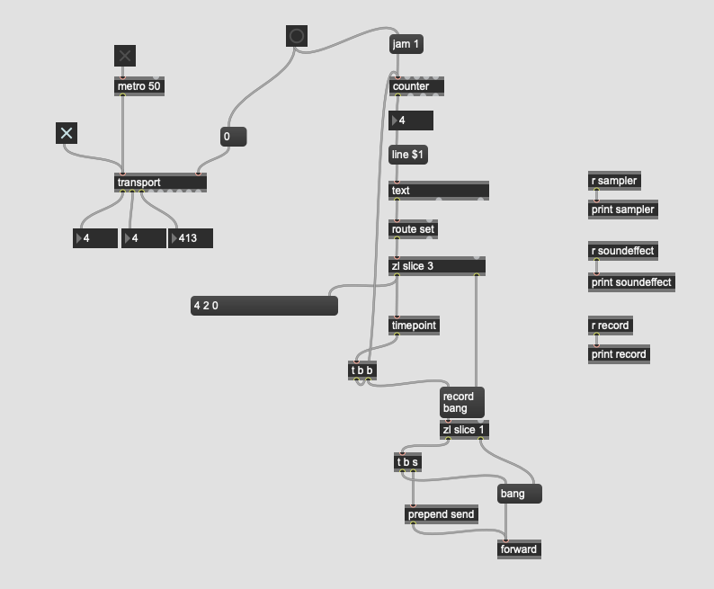

