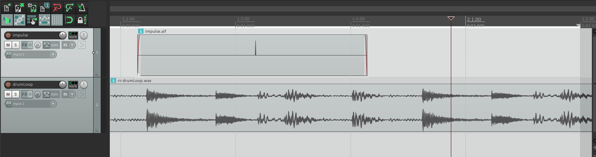
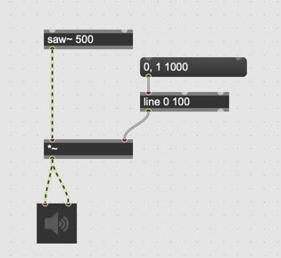

## K7 Automation with Audio

Audio signals controls audio parameter sounds strange but this is a common practice in analog synthesizer world (i.e. LFO etc.)
There are several advantages to use audio for control and automation.

1. Maximum precision and no latency
    - The non tilde objects and tilde objects do not communicate so often. They communicate each other every N samples (N can be 64 /128/256/512/1024). Audio data has no latency and the resolution in time is very high as the audio data. 
2. Audio feature such as envelope can be extracted and applied to another audio data very easily. So it is cumbersome to convert them to control data and convert again when you apply it.
3. You can place a queue for some events (e.g. triggering filter for the live performer, changing the light color, start the servo using arduino) in a DAW software along with your fixed-tracks. The timing of queues and the audio is exactly in sync.
4. Control data is somewhat already encoded in the audio signal (in case of M/S or Ambisonics)

  
In the screenshot below, an audio impulse is placed along with the fixed audio track to be used as a trigger for some events.

### Assignment 1: Experience the resolution of audio 

The following patch implements a fade-in effect of saw~ but the gain is only updated every 100 msec due to the second argument of line.

- Program the patch in Max 
- change the second argument to 50, 20 or 5. Is the sound of fade-in improved?
- In case bigger vector size is used, is the sound of transition still intact?
- replace [line] with [line~] so the ramp becomes audio data. Is the sound quality improved?

### Assignment 2: Audio Property mapping

Record your speech for 5000 msec in a buffer.
While playing back the speech, extract the envelope of the recorded sound, using [average~] and apply the extracted envelope to the audio signal coming from a [noise~].
Is the extracted rhythmic aspect of your speech clearly heard?

### Assignment 3: Processing on the data 
In the patch for assignment 2.
- Playback the recorded voice 2 times faster or slower
- Playback the recorded voice backward
- Apply gate effect somehow and cut the floor noise and very soft sound in order to emphasize more accents.

### Assignment 4: Trigger points along with audio data

Download [this 4ch-Audio file](K7/loop_with_queue.wav).

The first two channel contains audio signal of a drum loop and the 3rd channel contains impulses for triggering event.

Apply a bandpass filter to the drumloop and change the center frequency of the bandpass filter randomly each time the 3rd output an impulse with as low latency as possible (max 1 sample)

Hint: sah~

### Assignment 5: Extension (advanced)
Think about different applications of the triggers from the 3rd channel and implement it in your patch.

