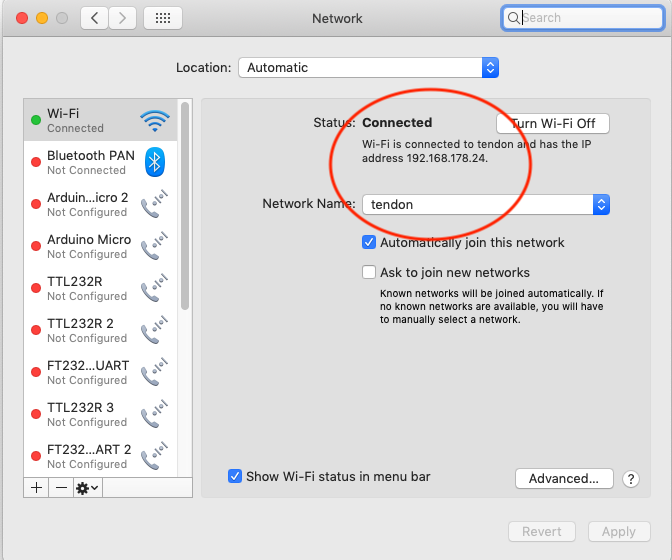
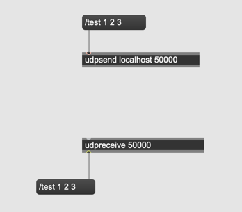
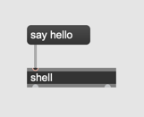

# K8 Automation mit OSC

## Basis

### IP Address

An Internet Protocol address (IP address) is a numerical label such as 192.0.2.1 that is connected to a computer network that uses the Internet Protocol for communication.
it identifies the host (computer), and it provides the location of the host in the network, and thus the capability of establishing a path to that host.

### Assignment 1

Check the IP address of your computer by opening "System Preference" -> "Network"

#### Ping
ping is a computer network administration software utility used to test the reachability of a host on an Internet Protocol (IP) network. 

### Assignment 2
Open the "terminal" application of your computer and type

> ping xxx.xxx.xxx.xxx 

where xxx.xxx.xxx.xxx should be the IP address of one of your classmate's computer.
Press the return key and check if the response comes back from your classmate's computer.

if you get

> Request timeout for ....

Your classmate's computer did not respond to your bing or such a computer doesn't exist

If you get

> 64 bytes from xxx.xxx.xxx.xxx: ...

Your classmate's computer responded to your ping

### Port number

A port number is a way to identify a specific process to which an internet or other network message is to be forwarded when it arrives at a server. All network-connected devices come equipped with standardized ports that have an assigned number.

[List of Port Numbers](https://en.wikipedia.org/wiki/List_of_TCP_and_UDP_port_numbers)

### Assignment 3:

Access the website of the hochschule

https://www.hfmt-koeln.de/

Try to access with the port number for https

https://www.hfmt-koeln.de:443

Try to access with the port number not for https

https://www.hfmt-koeln.de:583

### Registered ports

The range of port numbers from 0 to 49151 are the well-known and registered ports. They are assigned by IANA for specific service upon application by a requesting entity.

This means the chance is very low that port number above 49151 is already used by somehting else.

# OSC (Open Sound Control)
[opensoundcontrol.org](http://opensoundcontrol.org)

Open Sound Control (OSC) is a protocol for communication among computers, sound synthesizers, and other multimedia devices that is optimized for modern networking technology. Bringing the benefits of modern networking technology to the world of electronic musical instruments, OSC's advantages include interoperability, accuracy, flexibility, and enhanced organization and documentation.

[Osc Compatible Software](https://opensoundcontrol.stanford.edu/page-list.html)

[Osc Specification](https://opensoundcontrol.stanford.edu/spec-1_0.html)

OSC message example

only OSC address patern
> /test

OSC address pattern + OSC type tag + OSC Argument
> /synth/freq f 444.0

OSC address pattern + OSC type tag + two OSC argument
> /synth/waveform sf rect 0.6 

In max, OSC type tags are deduced, so we don't have to type them manually.

### Assignment 4: Loop-back

Implement the following patch and send an osc message to your computer from your computer.

Hint: localhost means the computer you are using

### Assignment 5: Send Message to another computer

replace "localhost" with the IP address of your classmate or the IP address of the instructor's computer and send a message.

### Assignment 6: Let other computers speak for you

Download [shell] external object from [here](https://github.com/jeremybernstein/shell/releases/tag/1.0b3) and load it to your patch (place shell external object in the same directory of your patch)

if you send a message prepended by "say", you computer read aloud the message.

Extend this patch and let your computer read aloud the incoming message from your classmates when they send an OSC message start with /say

e.g. If I send the following message to your computer 

> /say Max programming is fascinating

Your computer should read a loud my message.

### Osc Compatible Software

[Touch OSC](https://hexler.net/products/touchosc)  
[Reaper](https://www.reaper.fm/sdk/js/js.php)  
[Touch Designer](https://derivative.ca/)  
[Logic Pro](https://www.apple.com/logic-pro/)  
[Processing](https://processing.org/)
[Super Collider](https://supercollider.github.io/)  
[Sonic Pi](https://sonic-pi.net/)

## IanniX (Osc Automation Sequencer)

[IanniX](https://www.iannix.org/en/)

### Assignment 7: Iannix and Max (advanced)

Study IanniX, compose a short piece with it, Receive the OSC message from IanniX and generate sound based on the incoming OSC messages in Max.

