#Automatisierung der Max-Programmierung mit Javascript


## Dokument

[JavaScript Usage In Max](https://docs.cycling74.com/max8/vignettes/javascript_usage_topic)


## Basis


### msg\_int(a), msg\_float(a)
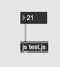

```
function msg_int(a)
{
	post(a+"\n");
}
```

### outlet
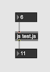

```
function msg_int(a)
{	
	outlet(0, a + 5);
}
```

### mehrere inlets/outlets

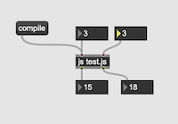

```
inlets = 2;
outlets = 2;

function msg_int(a)
{
	if(inlet == 0)
	{
		outlet(0, a + 5);
		outlet(1, a + 6);
	}
	else
	{
		outlet(0, a * 5);
		outlet(1, a * 6);
	}
}
```

## Dynamische Instanzierung eines Objektes

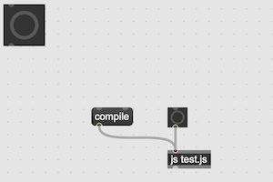


```
function bang()
{
	this.patcher.newobject("button", 10, 10, 50, 50);
}
```

## Argumenten

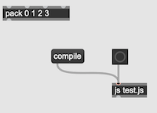

```
function bang()
{
	this.patcher.newdefault(10, 10, "pack", 0, 1, 2, 3);
}
```

## Dynamische Verbindung der Objekten

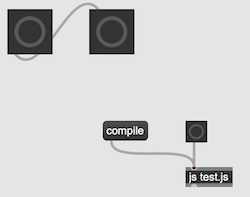

```
function bang()
{
	var leftButton = this.patcher.newobject("button", 10, 10, 50, 50);
	var rightButton = this.patcher.newobject("button", 100, 10, 50, 50);
	this.patcher.connect(leftButton, 0, rightButton, 0);
}
```

## Die Entfernung der Objekten

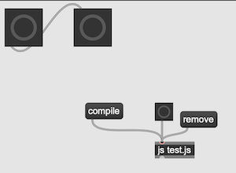

```
var leftButton;
var rightButton;

function bang()
{
	leftButton = this.patcher.newobject("button", 10, 10, 50, 50);
	rightButton = this.patcher.newobject("button", 100, 10, 50, 50);
	this.patcher.connect(leftButton, 0, rightButton, 0);
}

function remove()
{
	this.patcher.remove(leftButton);
	this.patcher.remove(rightButton);
}
```

## Parameterkontroll

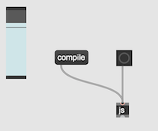

```
function bang()
{
	var slider = patcher.newobject("slider", 10, 10, 30, 100);
	slider.message("int", 100);
}
```

## Kontroll der existierenden Objekten

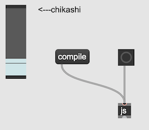

```
function bang()
{
	var slider = patcher.getnamed("chikashi");
	slider.message("int", 25);
}
```

## Kombination

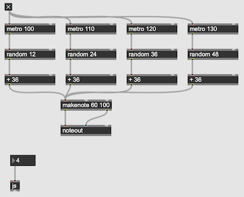

```
function msg_int(num)
{
	
	var toggle = patcher.newobject( "toggle", 10, 10, 15, 15);
	
	var makenote = patcher.newdefault(120, 200, "makenote", 60, 100);
	var noteout = patcher.newdefault(120, 250, "noteout");
	patcher.connect(makenote, 0, noteout, 0);
	patcher.connect(makenote, 1, noteout, 1);

	
	for(var i = 0; i < num; ++i)
	{
		var metro = patcher.newdefault(10 + i * 120, 50, "metro", i * 10 + 100);
		var random = patcher.newdefault(10 + i * 120, 100 , "random", i * 12 + 12);
		var plus = patcher.newdefault(10 + i * 120, 150, "+", 36);	
		
		patcher.connect(toggle, 0, metro, 0);
		patcher.connect(metro, 0, random, 0);
		patcher.connect(random, 0, plus, 0);
		patcher.connect(plus, 0, makenote, 0);
	}
	

	toggle.message("int", 1);
	
}

```
## Task


```
var task = new Task(bangout, this);
task.interval = jsarguments[0];	

function bangout()
{
	outlet(0, "bang");
}

function msg_int(on)
{
	if(on > 0)
	{
		task.repeat();
	}
	else
	{
		task.cancel();
	}
}
```


## pattr und js

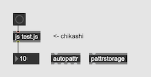


```
var somevalue = 10;

function setvalueof(v)
{
	somevalue = v;
}

function getvalueof()
{
	return somevalue;
}

function bang()
{
	outlet(0, somevalue);	
}
```
## jsui

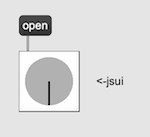
