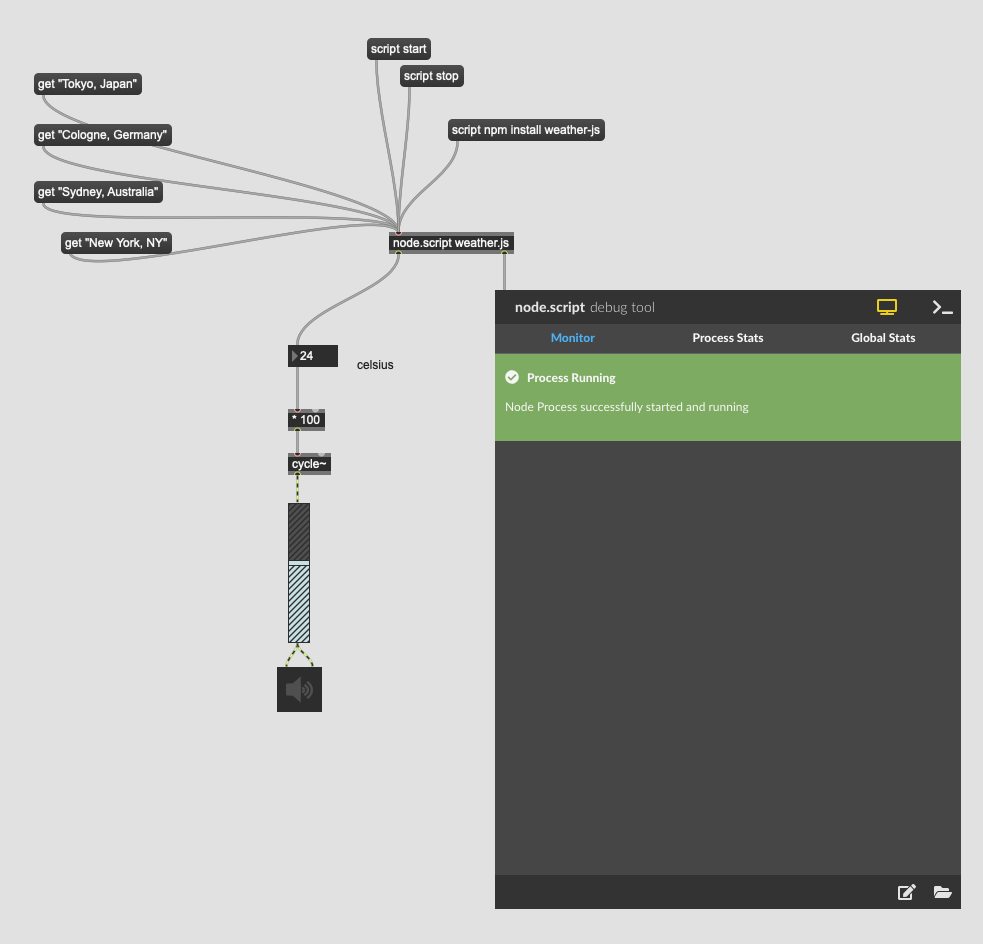

# K9 Data-based sonification

## Sonification

```
Sonification is the use of non-speech audio to convey information or perceptualize data.[1] Auditory perception has advantages in temporal, spatial, amplitude, and frequency resolution that open possibilities as an alternative or complement to visualization techniques.

For example, the rate of clicking of a Geiger counter conveys the level of radiation in the immediate vicinity of the device.
```

Markus Schmickler
[Bonner durchmusterung](http://piethopraxis.org/projects/bonner-durchmusterung/)


## Node.js

```
Node.js ist eine serverseitige Plattform in der Softwareentwicklung zum Betrieb von Netzwerkanwendungen. Insbesondere lassen sich Webserver damit realisieren. Node.js wird in der JavaScript-Laufzeitumgebung „V8“ ausgeführt, die ursprünglich für Google Chrome entwickelt wurde, und bietet eine ressourcensparende Architektur, die eine besonders große Anzahl gleichzeitig bestehender Netzwerkverbindungen ermöglicht.
```

[Video](https://www.youtube.com/watch?v=qSZH6fjOcXE)

## Node for Max

[Node for Max v1.1.2](https://docs.cycling74.com/nodeformax/api/)


## Daten im Internet in Max-Patch verwenden

node.js

``` 
const weather = require('weather-js');
const MAX = require('max-api');

MAX.addHandler("get", (city) => {
	weather.find({search: city, degreeType: 'C'}, function(err, result) {
  		if(err) console.log(err);
 
  		MAX.outlet(parseInt(result[0]["current"]["temperature"]));
	});
});

```




## Weitere Anwendungen von Node for Max

[Repo](https://github.com/Cycling74/n4m-examples)
  