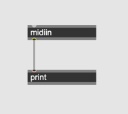
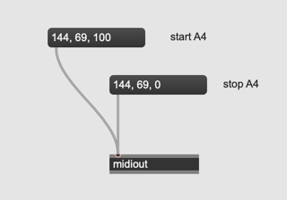

# 9 Automation with MIDI

MIDI ... Musical Instrument Digital Interface
MIDI is a technical standard that describes a communication protocol, digital interface, and electrical connectors that connect a wide variety of electronic musical instruments, computers, and related audio devices for playing, editing, and recording music.

## MIDI Specification

[MIDI website](https://www.midi.org/)

## Principle

MIDI message is extremely simple. MIDI messages consist of **3 x 1byte messages**
Each byte has own name.

1. Status Byte ... MSB 1
2. Data Byte 1 ... MSB 0
3. Data Byte 2 ... MSB 0

Status Byte is always equals to or above 128 and data bytes are always below 128.

### Assignment 1: MIDI as raw bytes

Connect a MIDI keyboard to your Mac or PC, create a patch with [midiin] object and check what MIDI message you receive, when pressing a key using [print]

### Assignment 2: Sending bytes to internal Synth (Mac Only)
[midiout] object sends out raw MIDI data to internal or external synthesizer.
Send following messages to [midiout]

replace 69 or 100 with other numbers and observe how the change influences the sound.

### Assignment 3: Playing back MIDI file in the patch

Download [MIDI file](K9/revolution.mid) of Chopin Etude. Load the file to patch using [seq] object and playback the piece, using [midiout].  observe raw midi messages from seq using [print]

source: http://www.piano-midi.de/chopin.htm

### Assignment 4: Visualizing chopin etude using kslider

Visualize how a pianist press the keys while playing the Chopin's Etude using [kslider].
Note [kslider] requires a pair of number (note number + velocity). [midiparse] object helps you to extract those numbers.

### Assignment 5: detonate

[detonate] is an extended version of [seq] object which allows use to edit MIDI events using GUI. In assignment 3 patch, replace [seq] with [detonate] and read the Chopin's Etude onto a [detonate] object

### Assignment 6: playing back with detonate

Unlike [seq] detonate object requires "next" message to outputs midi messages after reciving "start" message. 
When it receives "next" message, it outputs, [delta-time pitch velocity duration] of one note from outlet 1-4, in which delta-time represents the time from this midi event to next midi event.
Implement a simple playback function using detonate.

Hint: [makenote] object accepts [pitch velocity duration] and automatically output midi note on, midi note off messages.

### Assignment 7: faster and slow playback

Because of the characteristics of [detonate] object, we can playback  MIDI files faster or slower. Playback the chopin's etude twice as fast as the original.

### Assignment 8: further manipulations in the patch

Because the output from the detonate object is purely numbers, we can modify it freely in the patch.

- Transpose down the piece by perfect 5th
- Play all notes with mezzo piano

